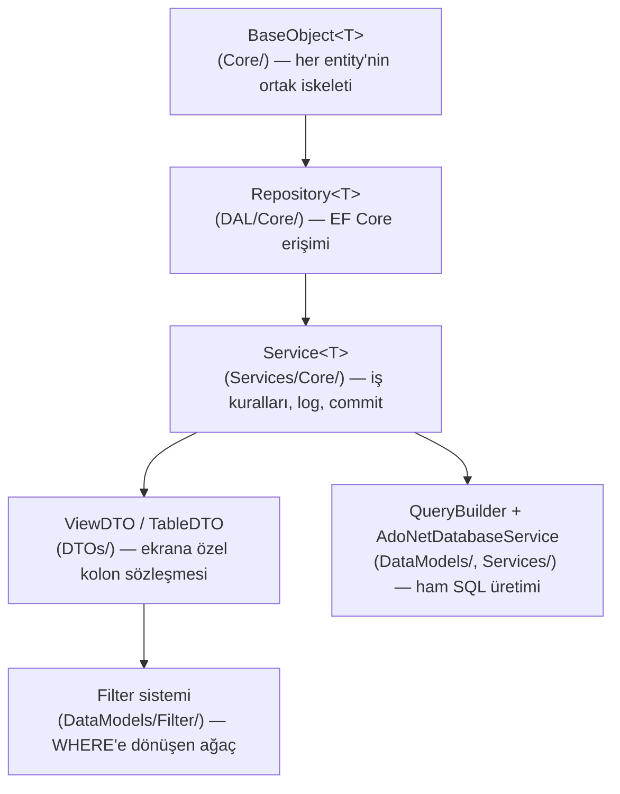

# 1.1 — Hydra Core: Çekirdek DLL

**Proje:** `Hydra` (class library, `Hydra.sln`'nin kalbi)
**Kimin altında çalışır:** `Hydra.WebApi` (REST katmanı) ve dolaylı olarak
`Hydra.RazorClassLibrary` (DTO sözleşmelerini paylaşır) bu DLL'e referans verir.

## Bu bölümde ne var

Hydra Core, "her uygulamada tekrar yazacağımız şeyi bir kere yaz" prensibiyle var
olan bir çekirdek. Kısaca dört katman:



Bu dört katmanı sırayla açacağız. Her biri kendinden sonraki katmana bir sözleşme
(interface veya DTO) devrediyor; katmanlar birbirinin implementasyon detayına
dokunmuyor.

## 1. `BaseObject<T>` — her şeyin atası

`Hydra/DataModels/... ` değil, doğrudan `Hydra/Core/BaseObject.cs` içinde tanımlı.
Her entity (`Log`, `CustomFile`, Tentacle'daki `Request`, bu kitapta kuracağımız
`Product`) bundan türer:

```csharp
public abstract class BaseObject<T> : IBaseObject<T> where T : BaseObject<T>
{
    public Guid Id { get; set; }
    public string? Name { get; set; }
    public string? Description { get; set; }
    public DateTime AddedDate { get; set; }
    public DateTime? ModifiedDate { get; set; }
    public bool IsActive { get; set; } = true;

    [Timestamp] public byte[]? RowVersion { get; set; }

    public BaseObject()
    {
        Initialize();
    }

    public virtual void Initialize()
    {
        Id = Guid.CreateVersion7();
    }

    public virtual T SetName(string? name) { Name = name; return (T)this; }
}
```

Üç karar burada dikkat çekiyor:

**`Guid.CreateVersion7()`.** Rastgele `Guid.NewGuid()` değil, zaman sıralı (UUIDv7)
bir id. Sebebi index performansı — sıralı olmayan GUID'ler clustered index'lerde
sayfa parçalanmasına (fragmentation) yol açar; zaman sıralı GUID yeni satırları hep
"sona" ekler. Bedeli: id'den zaman bilgisi çıkarılabilir olması (genelde önemsiz,
ama dışa açılan bir API'de id'yi "gizli" saymayın).

**`RowVersion` + `[Timestamp]`.** EF Core'un optimistic concurrency mekanizması —
iki kullanıcı aynı kaydı aynı anda güncellerse ikinci `UPDATE` `RowVersion` uyuşmadığı
için `DbUpdateConcurrencyException` fırlatır. Bu, Hydra'nın "son kaydeden kazanır"
yerine "çakışmayı fark et" tercihi.

**Kurucu, `virtual Initialize()`'ı çağırıyor.** Küçük ama tehlikeli bir C# detayı:
temel sınıfın kurucusu, türetilmiş sınıfın alanları henüz atanmadan çalışır. Bunu
görmezden gelen bir override, `NullReferenceException` üretir — bu tam olarak
`JoinedFiltersGroup` filtre sisteminde yaşadığımız hata (bkz.
[`Hydra/Docs/filters.md`](../../Docs/filters.md#the-base-constructor-trap)). Kendi
entity'nizde `Initialize()`'ı override edecekseniz, "henüz hiçbir alan set
edilmemişken çağrılabilirim" varsayımıyla yazın.

`IHierarchicalObject<T>` ayrı bir opsiyonel arayüz — `ParentId`/`Parent`/`Children`
ile ağaç yapılı entity'ler (`OrganizationUnit` gibi) için `GetAncestors()` /
`GetAllDescendants()` default implementasyonlarını C# 8 interface default method
özelliğiyle bedava veriyor.

## 2. `Repository<T>` — EF Core'un ince bir sarmalayıcısı

`Hydra/DAL/Core/Repository.cs`. Generic, `T : BaseObject<T>` kısıtlı, DI ile
enjekte edilen bir `DbContext` üzerinden `DbSet<T>` alıyor:

```csharp
public Repository(RepositoryInjector injector)
{
    _context = injector.Context;
    _dbSet = injector.Context.Set<T>();
}
```

Dikkat: `context.Set<T>()` — yani **her entity, `DbContext`'te bir `DbSet<T>`
tanımlı olmak zorunda**. Bu kısıt önemli bir tuzak: bir entity sadece
`TableService`/`QueryBuilder` (ham SQL) yoluyla okunuyorsa `DbSet<T>` şart değil,
ama biri o entity için `Repository<T>` inşa etmeye kalkarsa (`Service<T>` her zaman
kalkar) patlar. `Log` tablosunun `HydraDbContext`'te `DbSet<Log>` satırı hâlâ yorum
satırı olarak durmasının canlı örneği bu — bkz. §6 açık maddeler.

Repository'nin verdiği değer CRUD değil (o zaten EF Core'un işi) — asıl değeri:

- `GetModifiedProperties` — `byte[]` alanları dahil, hangi property'nin gerçekten
  değiştiğini `ChangeTracker`'dan çıkarıyor (audit log'a "ne değişti" yazmak için).
- `FromSqlInterpolated` — parametreli ham SQL çalıştırıp hataları yutmak yerine
  `Result.Logs`'a yazan bir güvenlik ağı.
- `UniqueFilter` — `virtual`, varsayılan olarak `Id` eşitliği ama bir entity
  doğal anahtarı (`ProductCategory.Code` gibi) varsa override edilebilir; `IsItNewAsync`
  bunu kullanır.

## 3. `Service<T>` — iş kuralları ve tek commit noktası

`Hydra/Services/Core/Service.cs` + partial dosyalar (`Service.Query.cs` gibi — C#
`partial class` ile tek sınıf birden fazla dosyaya bölünmüş, sorumluluk bazında).

```csharp
public Service(ServiceInjector injector)
{
    _unitOfWork = injector.UnitOfWork;
    _repositoryFactory = injector.RepositoryFactory;
    SetRepository();                              // Repository<T>'yi factory ile kurar
    _lazyLogService = injector.GetServiceLazy<ILogService>()!;
    _tableService = injector.TableService;
}

public async Task<bool> CommitAsync()
{
    if (!EnableForCommitting) return true;
    return await _unitOfWork.CommitAsync();       // SaveChangesAsync burada, tek yerde
}
```

Üç şey dikkat çekiyor:

**`EnableForCommitting` / `DisableToCommit()`.** Bir işlemi (mesela toplu import)
birden fazla `Service<T>.CreateAsync` çağrısıyla yapıp en sonda tek `CommitAsync`
istiyorsanız, ara commit'leri kapatabiliyorsunuz — Unit of Work deseninin klasik
"tek transaction, çok işlem" ihtiyacı.

**Log her yerde opsiyonel bağımlılık.** `_lazyLogService` `Lazy<T>` — sebebi
muhtemelen dairesel bağımlılığı kırmak (log servisi de bir `Service<Log>`, o da
aynı DI zincirinden geçiyor). `SaveErrorLogAsync`/`SaveInfoLogAsync` her önemli
işlemin etrafını sarıyor — bu yüzden Tentacle'da her entity'nin Details ekranında
otomatik bir Logs sekmesi olması mümkün: sistem zaten her create/update/delete'i
kendiliğinden logluyor.

**`SeedAsync` sadece test/geliştirme için.** `Hydra.TestManagement.SampleDataFactory`
ile rastgele örnek veri üretip `CreateAsync` çağırıyor — WebApi tarafında
`#if DEBUG` bloğu içinde `Seed/{count}` endpoint'i olarak açığa çıkıyor (bkz.
[1.2 — Hydra.WebApi](02-hydra-webapi.md)). Production build'de bu endpoint
derlenmiyor bile.

## 4. Select yolu: `SelectWithTableAsync` — DTO katmanının EF'i devre dışı bırakması

Burada Hydra'nın en özgün kararı geliyor. CRUD'un dört harfinden C/U/D (Create,
Update, Delete) EF Core üzerinden gidiyor — yukarıdaki `Repository<T>`. Ama **Select,
EF Core'u hiç kullanmıyor.** `Service.Query.cs`:

```csharp
public async Task<List<TResult>> SelectWithTableAsync<TResult>(ITable table) where TResult : class
{
    return (await _tableService.GetTableAsync(table)).Cast<TResult>();
}
```

`_tableService` (`Hydra/Services/TableService.cs`) `QueryBuilder`'a düşüyor, o da
`AdoNetDatabaseService` ile ham ADO.NET (`IDbConnection`/`IDbCommand`) çalıştırıyor.
Neden? Çünkü listeleme ekranlarının ihtiyacı EF Core'un LINQ-to-SQL çevirisinin iyi
karşılayamadığı bir şey: **çalışma zamanında** (runtime'da) hangi kolonların
seçileceği, hangi filtrelerin uygulanacağı, hangi tabloların join edileceği —
hepsi `TableDTO` içinde veri olarak geliyor, derleme zamanında bilinmiyor. EF
Core'un tip-güvenli LINQ ifadeleri bunun için tasarlanmadı; dinamik SQL üretimi
(parametreli, enjeksiyona kapalı) burada daha doğru araç.

Bu tercihin tam mekaniğini — `TableDTO`'nun neyi taşıdığını, `MetaColumnDTO`'nun
kolon/filtre/sıralamayı nasıl tek objede topladığını — ayrı bir bölümde işliyoruz:
[2.1 — Table hikayesi ve stateless mimari](../02-Core-Systems/01-table-dto-and-statelessness.md).
SQL'in tam olarak nasıl üretildiğini, harf harf, [2.3 — A Journey of a Value](../02-Core-Systems/03-journey-of-a-value.md)
dokümanında izliyoruz.

## 5. `ViewDTO` — ekrana göre kolon sözleşmesi

`Hydra/DTOs/ViewDTOs/ViewDTO.cs`. Her entity için bir `XDTO : ViewDTO` yazılır ve
`LoadConfigurations()` metodunda, entity'nin her property'si için "hangi view'da
nasıl görünsün" tanımlanır:

```csharp
SetConfigurationsViaPropertyInfo(
    propertyInfo: ReflectionHelper.GetPropertyOf<LogDTO>(x => x.ProcessType),
    configurations: new List<IConfiguration>
    {
        new ListViewConfiguration(
                toSelect: new AttributeToSelect(1),
                toFilter: new AttributeToFilter(nameof(EqualFilter)),
                toOrder:  new AttributeToOrder(isOrderable: true),
                elementType: HtmlElementType.DropdownList)
            .AlsoUseToCreateCollectionViewConfiguration(),
        new DetailsViewConfiguration()
    },
    displayName: "Operation");
```

`ViewType` altı değer alır: `ListView`, `CollectionView` (bir başka entity'nin
Details ekranındaki alt sekme), `DetailsView`, `CreateView`, `EditView`,
`LookupView`. **Kritik kural: view type'lar arasında fallback yok.** Bir kolonun
`CollectionView` konfigürasyonu tanımlı değilse, o view'da o kolon hiç görünmez —
"veri gelmedi" değil, "kimse istemedi" durumu. Bunun nasıl bir tuzağa dönüştüğünü
(enum kolonlarının uzun süre collection view'larda kaybolması) ve genel kolon
sistemini [`Hydra/Docs/view-configurations.md`](../../Docs/view-configurations.md)
belgeliyor — burada tekrar etmiyoruz, oraya yönlendiriyoruz.

## 6. Filter sistemi — Composite deseni ders kitabı gibi

`Hydra/DataModels/Filter/`. On beş filtre tipi (`EqualFilter`, `ContainsFilter`,
`BetweenFilter`, `InFilter`...) hepsi `Filter` taban sınıfından, hepsi
`IQueryableFilter` arayüzünden türer. `JoinedFiltersGroup` de aynı arayüzden türeyen
bir **composite** — iki filtreyi `And`/`Or` ile birleştiren düğüm, kendisi de bir
filtre olduğu için başka bir grubun operandı olabilir. N filtre, sol-ağırlıklı bir
ağaca katlanıyor: `(((f0 And f1) And f2) And f3)`.

Bunun altında, kolay gözden kaçan ama bozulursa sorguyu sessizce yanlış çalıştıran
bir **parametre numaralama invariant'ı** var: SQL metni `@{StartParameterIndex}`
kullanıyor, parametre sözlüğü ise kök filtrenin düzleştirilmiş `Parameters`
listesindeki **pozisyona** göre `@0`, `@1`... anahtarlıyor. İkisi uyuşmazsa
parametreler yanlış kolona bağlanır — sessizce, hatasız, yanlış sonuçla. Bu
invariant'ın tam kanıtı ve geçmişte nasıl bozulduğu (`BaseObject` kurucu tuzağı)
[`Hydra/Docs/filters.md`](../../Docs/filters.md) içinde.

## Dosya haritası (bu bölümde bahsedilenler)

| Sorumluluk | Yol |
|---|---|
| Entity iskeleti | `Hydra/Core/BaseObject.cs` |
| EF Core erişimi | `Hydra/DAL/Core/Repository.cs` |
| İş kuralları, commit | `Hydra/Services/Core/Service.cs`, `Service.Query.cs` |
| Ekrana özel kolon sözleşmesi | `Hydra/DTOs/ViewDTOs/ViewDTO.cs`, `Hydra/DTOs/TableDTO.cs` |
| Dinamik SQL üretimi | `Hydra/DataModels/QueryBuilder.cs`, `Hydra/Services/AdoNetDatabaseService.cs` |
| Filtre ağacı | `Hydra/DataModels/Filter/*.cs` |

---

## ⭐ İleride Yapılacaklar / Not Edilenler

- `DbSet<Log>` hâlâ `HydraDbContext`'te yorum satırı — `Repository<Log>` inşa
  edilirse (bugün hiçbir yerde edilmiyor, ama bir gün biri `Service<Log>` üzerinden
  Create/Update denerse) patlar. Ya `DbSet` eklenmeli ya da `Log` için
  `Repository<T>`'nin hiç kullanılmayacağı açıkça belgelenmeli.
- `Service<T>.SeedAsync` `SampleDataFactory.CreateSample<T>()` kullanıyor — bu
  factory'nin nasıl "makul" örnek veri ürettiği (foreign key'leri nasıl dolduruyor,
  enum'ları nasıl seçiyor) ayrı bir bölümü hak ediyor, henüz yazılmadı.
  (Bu kitapta Bölüm 4'te `Product` örneğiyle test edilecek.)
- `Repository<T>.UniqueFilter` varsayılan olarak `Id` eşitliği; doğal anahtarlı
  entity'ler için (`ProductCategory.Code` gibi) override örneği henüz hiçbir
  yerde gösterilmiyor — Bölüm 4'te ele alınacak.
