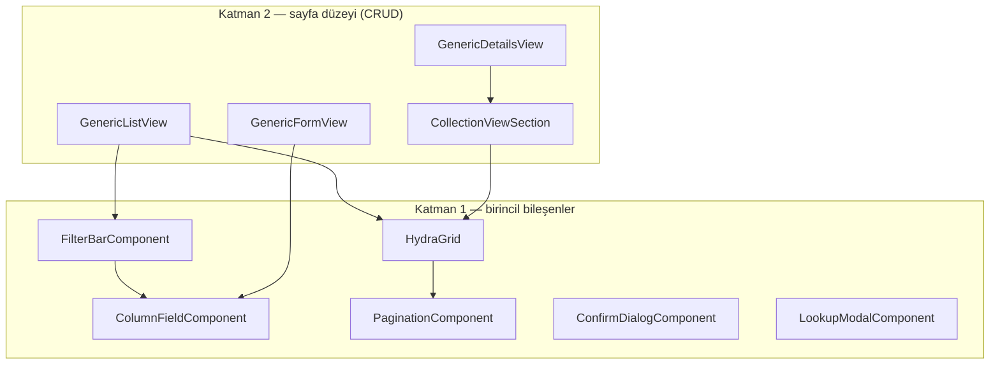

# 1.3 — Hydra.RazorClassLibrary: Blazor Component Kiti

**Proje:** `Hydra.RazorClassLibrary` (Razor Class Library, `Hydra.sln`'nin bir parçası)
**Rolü:** `TableDTO`'yu (bkz. [2.1](../02-Core-Systems/01-table-dto-and-statelessness.md))
ekrana çeviren, hiçbir CSS framework'üne bağlı olmayan Blazor component seti.
DevExpress XAF'ın Blazor tarafındaki karşılığı burası — "entity'yi tanımla, ekranı
otomatik al" vaadinin gerçekleştiği katman.

Bu bölüm RCL'in **ne içerdiğini** haritalıyor. Bir component'in *nasıl çalıştığını*
ve CSS/HTML'i dışarıdan nasıl değiştirdiğinizi ayrı, daha derin bir bölümde
işliyoruz: [2.2 — Component Anatomisi ve Theming](../02-Core-Systems/02-components-and-theming.md).

## İki katmanlı component mimarisi



**Katman 1**, tek bir görsel görevi olan, `TableDTO`/`MetaColumnDTO` gibi düşük
seviye tiplerle konuşan parçalar: `HydraGrid` satır/kolon çizer, `FilterBarComponent`
filtre girdilerini üretir, `ColumnFieldComponent` tek bir form alanını
`HtmlElementType` metadata'sına göre render eder.

**Katman 2**, bir sayfanın tamamını oluşturan, `ApiClient<T>` ile HTTP'ye giden
generic view'lar: `GenericListView` (liste ekranı), `GenericFormView` (Create/Edit
— mod parametreli tek component), `GenericDetailsView` (özet + master-detail sekme
şeridi), `CollectionViewSection` (Details ekranındaki her bir alt-tablo sekmesi).

Bir Tentacle sayfası (`Pages/Crud/Product/Index.razor`) genelde tek satırdır:

```razor
<GenericListView T="Product" Client="Client" Title="Products" />
```

Geri kalan her şey — kolonlar, filtreler, sayfalama, Create/Edit/Delete
butonları — `ProductDTO.LoadConfigurations()`'dan türüyor.

## `ApiClient<T>` — HTTP'nin tek giriş kapısı

`Services/Core/ApiClient.cs`. Generic view'ların hepsi bunun üzerinden konuşuyor,
hiçbiri doğrudan `HttpClient` görmüyor:

```csharp
public async Task<TableDTO?> SelectAsync(TableDTO? tableDTO = null)
{
    tableDTO ??= new TableDTO();
    if (string.IsNullOrEmpty(tableDTO.Name))
        tableDTO.Name = Controller;   // typeof(T).Name

    // viewType AYRICA query string olarak da gidiyor — sunucudaki
    // [FromQuery] varsayılanı, gövdedeki TableDTO.ViewType'ı ezmesin diye.
    return await Http.PostEnvelopeAsync<TableDTO>(Controller, "Select", tableDTO,
        parameters: new() { ["viewType"] = tableDTO.ViewType.ToString() });
}
```

`Controller => typeof(T).Name` — yani `ApiClient<Product>` otomatik olarak
`/Product/...` rotalarına gidiyor. Bu, WebApi tarafındaki controller isimlendirme
konvansiyonuyla (bkz. [1.2](02-hydra-webapi.md)) simetrik: iki taraf da "tip adı =
route adı" varsayımını paylaşıyor, aradaki bağ hardcode edilmemiş.

`GetCreateViewAsync` / `GetUpdateViewAsync` de aynı `SelectAsync`'i farklı
`ViewType` ile çağırıyor — yani "boş bir Create formunun kolonlarını getir" ile
"bir listeyi filtrele" sunucu tarafında **aynı endpoint**, sadece `ViewType`
farklı. `GetDetailsViewAsync` ayrı bir yol izliyor çünkü sunucudaki `Details`
endpoint'i `Select`'ten farklı zarflıyor (bkz. [1.2 §⭐](02-hydra-webapi.md)).

## `LookupService` — okunabilir metnin tek kaynağı

`Services/Core/LookupService.cs`. Enum'ların `0/1/2` yerine `[Display(Name=...)]`
etiketiyle görünmesi, boolean'ların Yes/No olması, foreign key dropdown'larının
seçenek listesini getirmesi — hepsi burada. `HydraGrid`, `FilterBarComponent`,
`ColumnFieldComponent` üçü de aynı `GetDisplayText`/`GetEnumOptions` metodlarına
gidiyor; mantık dört yerde tekrarlanmıyor. Detaylı mekanizma:
[`Hydra/Docs/enum-and-value-display.md`](../../Docs/enum-and-value-display.md).

## Kimlik doğrulama iskeleti — kurulu ama bağlı değil

`Services/Authentication/AuthenticationService.cs` ve
`HydraAuthenticationStateProvider.cs` mevcut; `Services/Storage/LocalStorageService.cs`
token saklamak için `ILocalStorageService` arayüzüyle hazır. Ama Tentacle'da
`Login.razor` şu an bu servisleri hiç çağırmıyor — "Log In" butonu doğrudan
Dashboard'a yönlendiren bir yer tutucu (bkz. [1.4 — Tentacle](04-tentacle-reference-app.md)).
Yani RCL'de auth **altyapısı** var, uygulamada **akışı** yok — ikisini
karıştırmayın.

## Theming: tek cümleyle

RCL hiçbir yerde renk, boşluk ya da framework class'ı basmaz — sadece
`hydra-*` adında semantik class'lar. Görünüm tamamen host projenin yüklediği
CSS'ten gelir. Bunun tam mekanizması (CSS değişkenleri, class override, ChildContent
ile markup enjeksiyonu) [2.2](../02-Core-Systems/02-components-and-theming.md)'de.

## Dosya haritası

| Sorumluluk | Yol |
|---|---|
| Liste/Form/Details/Collection sayfa şablonları | `Components/CRUD/*.razor` |
| Tablo çizimi | `Components/Grids/HydraGrid.razor` |
| HTTP giriş kapısı | `Services/Core/ApiClient.cs` |
| Enum/boolean/lookup metin çözümü | `Services/Core/LookupService.cs` |
| Auth iskeleti | `Services/Authentication/*.cs` |
| Varsayılan (nötr) tema | `wwwroot/css/hydra-default.css` |

---

## ⭐ İleride Yapılacaklar / Not Edilenler

- Auth altyapısı (`AuthenticationService`, `HydraAuthenticationStateProvider`,
  `LocalStorageService`) yazılmış ama hiçbir uygulamada uçtan uca denenmemiş.
  İlk gerçek entegrasyon Tentacle'da olacaksa, bu üçünün birlikte çalıştığını
  doğrulayan bir "auth journey" dokümanı (bu kitabın [2.3](../02-Core-Systems/03-journey-of-a-value.md)
  dokümanına kardeş) yazılabilir.
- `ColumnFieldComponent`'teki `InputToUploadFile` durumu şu an tamamen dekoratif
  (`<input type="file">`, hiçbir `@onchange` yok) — ayrıntı ve puanlama için
  [3.1 — FileManagement Audit](../03-FileManagement-Review/01-current-state-audit.md).
