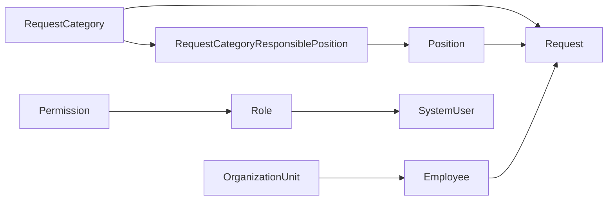

# 1.4 — Tentacle: Referans Uygulama

**Proje:** `Tentacle` (ayrı repo, kendi solution'ı `HydraTentacle.sln`)
**Rolü:** Hydra'nın "boşta duran bir çerçeve" olmadığını kanıtlayan, gerçek bir
problemi çözen uygulama. Aynı zamanda Hydra'nın eksiklerinin ortaya çıktığı yer —
bu kitaptaki bulguların çoğu (Filter sınırlaması, CollectionView boşlukları,
database routing hatası) Tentacle'ı gerçek veriyle çalıştırırken bulundu.

## Domain: "her şey bir Request ve bir Response'tur"

Tentacle bir iş/görev takip sistemi. Merkezinde `Request` var; etrafında onu
sınıflandıran, sahiplendiren ve yetkilendiren entity'ler:



`RequestCategoryResponsiblePosition` — adı uzun ama görevi net: hangi kategori
talebin hangi pozisyon(lar) tarafından sorumlu tutulacağını eşleştiren bir
many-to-many köprü tablosu. Bu kitabın Bölüm 4'ünde kuracağımız
`Product`/`ProductCategory`/`ProductImage` seti de aynı desenleri (bire-çok,
köprü tablosu, `CustomFile` ile dosya ilişkisi) tekrar edecek — burada gördüğünüz
her şablon orada tekrar karşınıza çıkacak.

## 36 CRUD ekranı, tek şablondan

Sekiz entity × dört ekran (`Index`/`Create`/`Edit`/`Details`) = 32, artı birkaç
özel ekran. Her biri `Hydra.RazorClassLibrary`'nin generic view'larını
örnekliyor — bkz. [1.3](03-hydra-razorclasslibrary.md). Örnek, `Position/Details.razor`:

```razor
<GenericDetailsView T="Position" Client="Client" Id="@Id" Title="Position Details">
    <CollectionViewSection Title="Employees" Controller="Employee" ForeignKeyName="PositionId" ParentId="@Id" />
    <CollectionViewSection Title="Category Responsibilities" Controller="RequestCategoryResponsiblePosition" ForeignKeyName="PositionId" ParentId="@Id" />
</GenericDetailsView>
```

Sekme başlıkları kasıtlı olarak **sade**: "Employees", "Bu Pozisyondaki Çalışanlar"
değil. Sekme zaten o kaydın Details ekranının içinde — ilişkiyi başlıkta tekrar
etmek satırı uzatmaktan başka bir işe yaramıyor.

## Her entity'nin bir Logs sekmesi var — FK olmadan

`GenericDetailsView`, entity'nin kendi tanımladığı `CollectionViewSection`'lara
**ek olarak**, otomatik bir "Logs" sekmesi ekliyor. `BaseObject` ile `Log` arasında
foreign key yok — bağ `EntityType`/`EntityId` üzerinden **select ile** kuruluyor
(gerçek bir FK ilişkisi değil, sorgu zamanında kurulan gevşek bir bağ). Bu deseni
ve `Log`'un neden ayrı bir veritabanında yaşadığını (`TentacleLogDatabase`) iki
ayrı yerde belgeledik, tekrar etmiyoruz:

- Mekanizma: [`Hydra/Docs/database-routing.md`](../../Docs/database-routing.md)
- Log'un kolon konfigürasyonu: [`Hydra/Docs/view-configurations.md`](../../Docs/view-configurations.md)

## Genel dil: İngilizce, geliştirici yorumları hariç

Arayüz (başlıklar, butonlar, dashboard kartları, navigasyon menüsü, DTO
`displayName`'leri) İngilizce. Kod içi yorumlar bilinçli olarak Türkçe bırakıldı
— onları kullanıcı değil, bu kod üzerinde çalışan geliştirici okuyor. Bu ayrımın
gerekçesi RCL'in theming felsefesiyle aynı: bir kütüphane/uygulama kendi dilini
tüketicisine (kullanıcıya) dayatmamalı, ama geliştirici notları başka bir
kitleye hitap ediyor.

## Dashboard — gerçek veriye bağlı, uydurma sayı yok

`Pages/Dashboard.razor`, tasarımdaki mockup sayılar yerine tamamen API'den gelen
veriyle çalışıyor. Kategori bazlı kırılım bugün N+1 sorgu ile yapılıyor (kategori
sayısı kadar filtreli sayım çağrısı) — kategori sayısı düşükken sorun değil, ama
tek seferde group-by dönen bir istatistik endpoint'i eklenirse tek çağrıya iner.
Bu, dashboard dosyasındaki kod yorumlarında da not edilmiş durumda.

## Public sayfalar ayrı bir layout kullanıyor

`Home` (landing), `Login`, `Dashboard` — `EmptyLayout` kullanıyor (kendi
sidebar/topbar'ını kendi çiziyor), geri kalan CRUD ekranları `MainLayout`
kullanıyor. `Login.razor`'daki "Log In" butonu şu an gerçek kimlik doğrulamaya
bağlı değil, doğrudan Dashboard'a yönlendiren bir yer tutucu — bkz.
[1.3 §⭐](03-hydra-razorclasslibrary.md).

## Dosya haritası

| Sorumluluk | Yol |
|---|---|
| Entity modelleri | `Source/HydraTentacle.Core/Models/**/*.cs` |
| View DTO'ları | `Source/HydraTentacle.Core/DTOs/*.cs` |
| CRUD ekranları | `Source/HydraTentacle.Blazor/Pages/Crud/**/*.razor` |
| Dashboard, Home, Login | `Source/HydraTentacle.Blazor/Pages/*.razor` |
| Uygulama teması | `Source/HydraTentacle.Blazor/wwwroot/css/tentacle-theme.css` |
| Kurulum rehberi | `TENTACLE_SETUP.md` |

---

## ⭐ İleride Yapılacaklar / Not Edilenler

- Kimlik doğrulama akışı uçtan uca bağlanmadı (bkz. yukarısı).
- Dashboard'un kategori kırılımı N+1 — küçük veri setinde zararsız, büyüdükçe
  bir group-by endpoint'i gerekecek.
- `.github/` klasörünün proje kökü yerine bir alt proje içinde de bulunması gibi
  küçük repo hijyeni maddeleri `Documentation/Hydra/COMMIT_PLAN.md §5.10`'da
  ayrıca listeli — burada tekrar etmiyoruz.
