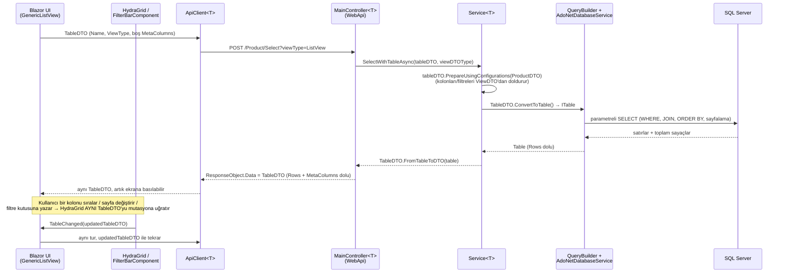

# 2.1 — Table'ın Hikâyesi: TableDTO ve Stateless Mimari

## "Bu sistemin adı ne?"

Sık sorulan bir soru, dürüst cevabı: **piyasada tek bir ismi olan, kitaplarda
"şu desen" diye geçen bir şey değil.** En yakın akrabaları OData'nın
`$select`/`$filter`/`$orderby`/`$top`/`$skip` sorgu dizesi ya da GraphQL'in
istemcinin şeklini belirlediği sorgu gövdesi — ama Hydra'nınki ikisinden de daha
küçük, daha az standart, tamamen kendi ekosistemine özel. Bu kitapta buna
**"TableDTO deseni"** diyeceğiz, çünkü zaten kod tabanındaki adı bu.

Doğru olan kısım şu: **evet, stateless.** REST'in klasik anlamında —
sunucu, iki istek arasında sizinle ilgili hiçbir şey hatırlamıyor. Ama bunun
*nasıl* sağlandığı, Hydra'yı sıradan bir "stateless API"den ayıran şey: state
sunucu tarafında session/cache olarak tutulup sadece bir id ile referanslanmıyor
— **state'in tamamı, her istekte, tek bir JSON gövdesinde gidip geliyor.**

## Ne taşıyor: `TableDTO`'nun alanları

`Hydra/DTOs/TableDTO.cs`. Önemli alanlar:

| Alan | Ne işe yarar |
|---|---|
| `Name` | Hangi tablo/entity (`"Product"`) |
| `ViewType` | `ListView` / `CollectionView` / `CreateView` / `EditView` / `DetailsView` / `LookupView` |
| `ViewDTOTypeName` | Hangi `XDTO`'nun kolon konfigürasyonu uygulanacak |
| `MetaColumns` | Seçilecek, filtrelenecek, sıralanacak kolonların **hepsi tek listede** |
| `JoinTables` | Hangi tabloların join edileceği |
| `PageNumber` / `PageSize` | Sayfalama isteği |
| `Rows` | *Yanıtta* dolu gelen satırlar |
| `TotalRecordsCount` / `FilteredTotalRecordsCount` / `TotalPagesCount` | *Yanıtta* dolu gelen sayaçlar |

Dikkat edilecek nokta: bu tek sınıf hem **istek** hem **yanıt**. `Rows` istekte
boştur, yanıtta doludur; `MetaColumns` her ikisinde de var ama isteği siz
şekillendirirsiniz (hangi filtre aktif), yanıtta sunucu onu zenginleştirip geri
yollar (kolon meta'sı, mevcut filtre değerleri, sıralama durumu — hepsi
korunarak). Aynı zarf, gidiş-dönüş boyunca aynı şekli koruyor.

## Round-trip: bir turun tam anatomisi

En kritik satır: **"boş" bir istek bile geçerli.** `MainController.Select`,
gelen `TableDTO` boşsa (`tableDTO ??= new TableDTO()`) veya `MetaColumns` içermiyorsa,
`ViewDTOType`'ı adından (`"{T}DTO"` konvansiyonu, bkz. [1.2](../01-Architecture/02-hydra-webapi.md))
bulup `PrepareUsingConfigurations` ile dolduruyor. Yani istemci "bana Product
listesini ver" demek için sadece `{ Name: "Product", ViewType: "ListView" }`
yollamak zorunda — hangi kolonların seçileceğini bilmesi gerekmiyor, o bilgi
`ProductDTO.LoadConfigurations()`'da sunucu tarafında yaşıyor.

## Neden bu kadar önemli: "state nerede yaşıyor" sorusunun cevabı

Geleneksel bir CRUD ekranında "şu an hangi sayfadayım, hangi filtre aktif,
hangi kolona göre sıralı" bilgisi genelde ya sunucu tarafında bir session'da
ya da istemci tarafında dağınık değişkenlerde tutulur. Hydra'da bu bilginin
**tek doğru kaynağı** her zaman elinizdeki `TableDTO` nesnesi. `HydraGrid` bir
kolona tıklandığında yeni bir "sıralama isteği" oluşturmuyor — elindeki
`TableDTO`'yu mutasyona uğratıp `TableChanged` event'iyle üst component'e
veriyor, o da **aynı nesneyi** tekrar `ApiClient.SelectAsync`'e yolluyor.
Sunucu iki istek arasında hiçbir şey saklamadığı için, ikinci isteğin doğru
çalışması tamamen "ilk yanıtta size geri verdiğim her şeyi bir sonraki istekte
bana aynen geri yolla" prensibine dayanıyor. Bu prensip bozulursa (bir yerde
`TableDTO`'nun bir parçası atlanıp yeniden `new TableDTO()` ile başlanırsa)
filtre/sıralama sessizce sıfırlanır — hata fırlatmaz, sadece "neden filtrem
gitti" diye sorulan bir bug olur.

Bu component tarafındaki mekaniğin (parametre-aşağı, callback-yukarı) tam
anlatımı: [2.2 — Component Anatomisi](02-components-and-theming.md).
Bir karakterin bu turu harf harf nasıl geçtiği: [2.3 — A Journey of a Value](03-journey-of-a-value.md).

## `MetaColumnDTO` — tek satırda üç görev

`TableDTO.MetaColumns` listesindeki her eleman aynı anda üç şeyi taşıyabilir:
**seçilecek mi** (`AttributeToSelect`), **filtrelenecek mi** (`AttributeToFilter`
+ bir `FilterDTO`), **sıralanacak mı** (`AttributeToOrder`). Bir kolon üçünü de
taşıyabilir, ikisini, birini ya da hiçbirini. Bu tek-liste tasarımı, "kolon
metadata'sı" ile "sorgu talebi"ni aynı objede birleştiriyor — ayrı bir
`SelectRequest`, ayrı bir `FilterRequest`, ayrı bir `SortRequest` yok, hepsi
`MetaColumnDTO` üzerinde.

## Dosya haritası

| Sorumluluk | Yol |
|---|---|
| Wire sözleşmesi | `Hydra/DTOs/TableDTO.cs` |
| Kolon/filtre/sıra tek objede | `Hydra/DTOs/MetaColumnDTO.cs` |
| `TableDTO ↔ ITable` dönüşümü | `TableDTO.ConvertToTable` / `TableDTO.FromTableToDTO` |
| İstemci tarafı çağrı | `Hydra.RazorClassLibrary/.../ApiClient.cs` |
| Sunucu tarafı giriş noktası | `Hydra.WebApi/Controllers/Base/MainController.cs` |

---

## ⭐ İleride Yapılacaklar / Not Edilenler

- "Boş istek" davranışı (`tableDTO ??= new TableDTO()`) güvenilir ama sessiz —
  bir istemci yanlışlıkla eksik bir `TableDTO` yollarsa hata almaz, sadece
  varsayılan konfigürasyonu görür. Şema doğrulaması (ör. zorunlu `Name` alanı
  eksikse 400 dönmesi) eklenebilir.
- `TableDTO` hem istek hem yanıt şekli olduğu için, API dokümantasyonu
  (Swagger/OpenAPI) üzerinde tek bir tip iki farklı anlam taşıyor — bu,
  otomatik üretilen API dokümanlarını kafa karıştırıcı hale getirebilir.
  Ayrı bir `TableRequestDTO`/`TableResponseDTO` ayrımı düşünülebilir, ama
  bugünkü tasarımın (tek tip, hep aynı şekil) basitliği bilinçli bir tercih.
