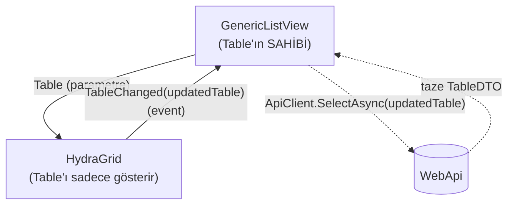

# 2.2 — Bir Component Nasıl Çalışır: HydraGrid Üzerinden Anatomi ve Theming

Bu bölüm iki soruyu birlikte cevaplıyor, çünkü ikisi de aynı tasarım kararının
iki yüzü: **bir Blazor component'i içeride nasıl çalışıyor**, ve **dışarıdan
HTML/CSS'ini nasıl değiştirebiliyoruz**. Örnek olarak `HydraGrid`'i seçtik —
sistemin en çok kullanılan, en temsil edici component'i.

## Bir component: parametre + state + render

`HydraGrid.razor`'ın `@code` bloğu bir sınıf gibi düşünülebilir: alanlar ve
metodlar taşır, üstteki markup ise o state'e göre HTML üretir. `[Parameter]`
işaretli özellikler dışarıdan gelen "girdi"dir:

```csharp
[Parameter] public TableDTO? Table { get; set; }
[Parameter] public EventCallback<TableDTO> TableChanged { get; set; }
[Parameter] public RenderFragment<RowDTO>? ChildContent { get; set; }
[Parameter] public bool ShowSearchBox { get; set; } = true;
```

`Table` — [2.1](01-table-dto-and-statelessness.md)'deki `TableDTO`, yani kolon
metadata'sı + satırlar + sayfalama + sıralamanın hepsini taşıyan tek sözleşme.
Grid'in tek girdisi bu.

## Render, koşullu markup'tır

```razor
@if (Table == null) { <SpinnerComponent /> }
else if (Table.Rows.Count == 0) { ...boş durum... }
else { ...asıl tablo... }
```

Üç farklı görsel durum var, hangisinin render edileceğine `Table` state'ine
bakarak karar veriliyor. `<table>` içindeki `@foreach (var column in
VisibleColumns)` ve `@foreach (var row in FilteredRows)` de aynı mantık —
Razor, C# döngülerini doğrudan markup'a gömmenize izin veriyor.

`VisibleColumns` ve `FilteredRows` computed property'ler — saklanmıyor, her
render'da `Table`'dan türetiliyor:

```csharp
private List<MetaColumnDTO> VisibleColumns => Table == null
    ? new List<MetaColumnDTO>()
    : Table.GetSelectedMetaColumnsExceptPrimaryKeyWithIncludes
           .Where(c => !c.IsJoinedTableKey)
           .OrderBy(c => c.Priority)
           .ToList();
```

Component kendi kolon listesini tutmuyor — state'in tek kaynağı `Table`,
component onu kopyalamıyor.

## Hücre metni: `LookupService`'e delege

```csharp
private string? CellText(RowDTO row, MetaColumnDTO column)
    => Lookup.GetDisplayText(column, RawValue(row, column));
```

`@inject LookupService Lookup` — component'lerin ikinci girdi kanalı:
parametreler dışında, `@inject` ile uygulama genelindeki servislere erişiyorlar.
Enum'un `0/1/2`'den okunabilir metne çevrilmesi burada oluyor (bkz.
[`Hydra/Docs/enum-and-value-display.md`](../../Docs/enum-and-value-display.md)),
component'in kendisi bunu hiç bilmiyor.

## Asıl mimari nokta: tek yönlü akış + callback ile geri bildirim

Kullanıcı bir kolon başlığına tıklayınca:

```csharp
private async Task OnSort(MetaColumnDTO column)
{
    ...
    Table.AlterOrAddMetaColumn(orderColumn);   // 1) kendi elindeki Table'ı değiştir
    await TableChanged.InvokeAsync(Table);      // 2) parent'a "değişti" diye haber ver
}
```

`HydraGrid` `Table`'ı **kendi başına yeniden yükleyemez** — API'ye gitme yetkisi
yok, sadece "bu tabloyu güncelledim, sen ne yapacaksan yap" diyor. Bu, "parametre
aşağı, event yukarı" akışı — React'teki controlled component'e çok benzer:



## Parent tarafı — `GenericListView.razor`

```csharp
private TableDTO? Table { get; set; }

private async Task LoadDataAsync()
{
    var request = Table ?? new TableDTO { Name = Client.Controller, ViewType = ViewType.ListView };
    Table = await Client.SelectAsync(request);
}

private async Task OnTableChanged(TableDTO updatedTable)
{
    Table = updatedTable;
    await LoadDataAsync();
}
```

```razor
<HydraGrid Table="@Table" TableChanged="OnTableChanged" ...>
```

Döngü şöyle kapanıyor: `GenericListView` state'in **sahibi**. `Table`'ı
`HydraGrid`'e parametre olarak veriyor. Kullanıcı grid içinde sıralama/sayfa
değiştirince `HydraGrid` kendi elindeki `Table`'ı mutasyona uğratıp
`TableChanged` event'ini tetikliyor. `GenericListView` bunu yakalayıp
`LoadDataAsync()` çağırıyor — aynı `TableDTO`'yu tekrar API'ye postalıyor,
sunucu stateless olduğu için her şeyi o DTO'nun içinden okuyup taze satırları
dolduruyor, sonuç tekrar aşağı akıyor.

## Composition — component içinde component

`HydraGrid` kendi içinde `<PaginationComponent>` ve `<SpinnerComponent>`
kullanıyor; `GenericListView` de kendi içinde `<HydraGrid>`,
`<FilterBarComponent>`, `<ConfirmDialogComponent>` kullanıyor. Component'ler iç
içe geçerek daha büyük ekranlar oluşturuyor — her biri kendi dar sorumluluğuna
bakıyor.

## `ChildContent` — parent'ın component'in içine markup enjekte etmesi

```razor
<HydraGrid ...>
    <ChildContent Context="row">
        <button @onclick="() => GoToUpdate(row.Id)">...</button>
        <button @onclick="() => AskDelete(row.Id)">...</button>
    </ChildContent>
</HydraGrid>
```

`RenderFragment<RowDTO> ChildContent` parametresi sayesinde `GenericListView`,
her satırın Actions hücresine ne basılacağına karar veriyor (Edit/Delete
butonları), ama satırı nasıl döngüye alacağını, hangi hücrenin nereye
geleceğini `HydraGrid` biliyor. Bu bir "slot" mantığı — component kendi
iskeletini çiziyor, boşluğu parent dolduruyor.

---

## HTML/CSS'i dışarıdan değiştirmek: üç seviye

### 1. CSS değişkenleri (en yaygın yol)

`hydra-default.css`'in tepesinde her renk/ölçü bir CSS custom property:

```css
:root {
    --hydra-primary: #0d6efd;
    --hydra-create:  #198754;
    --hydra-edit:    #0d6efd;
    --hydra-delete:  #dc3545;
    --hydra-details: #0dcaf0;
    --hydra-radius:  0.375rem;
}
```

Tentacle'ın kendi `tentacle-theme.css` dosyası bunları ezip kendi paletine
çeviriyor:

```css
:root {
    --hydra-primary: var(--tnt-cyan);
    --hydra-create:  var(--tnt-cyan);
}
```

Bu çalışıyor çünkü `App.razor`'da iki stylesheet **sırayla** yükleniyor:

```razor
<link rel="stylesheet" href="_content/Hydra.RazorClassLibrary/css/hydra-default.css" />
<link rel="stylesheet" href="css/tentacle-theme.css" />
```

CSS'in cascade kuralı gereği sonra gelen kazanır. Component tarafında hiçbir
değişiklik gerekmiyor — component zaten `var(--hydra-create)` diye okuyor,
hangi değeri bulursa onu kullanıyor.

### 2. Doğrudan class'ı hedefleyip komple yeniden yazma

Değişken yetmiyorsa — layout, padding, hover davranışı gibi değişken olarak
dışa açılmamış bir şeyi değiştirmek istiyorsanız — component'in bastığı
semantic class'ı doğrudan hedefleyip kuralı komple yazabilirsiniz:

```css
.hydra-btn--create { /* Tentacle'a özgü glow/gradient efekti */ }
.hydra-grid__th { /* Tentacle'ın kendi tipografi/spacing kararları */ }
```

Component `class="hydra-btn hydra-btn--create"` bastığı sürece, o class'a
CSS'te ne yazarsanız o uygulanır — component'in `.razor` dosyasına dokunmadan.
Bu yüzden RCL'de "renk/spacing class'ı EKLEME" kuralı var: component kendi
içinde Bootstrap class'ı ya da `style="color:red"` basmış olsaydı, host CSS'in
onu ezmesi `!important` gibi çirkin şeylere muhtaç kalırdı. Component sadece
nötr, isimlendirilmiş bir "kanca" (`hydra-grid__th`) bastığı için host o
kancaya istediğini asabiliyor.

### 3. `RenderFragment` ile markup enjeksiyonu

Yukarıdaki `ChildContent`/`RowActions` örneği CSS değil **HTML enjeksiyonu** —
component'in çizdiği iskeletin belirli bir boşluğuna tamamen kendi markup'ınızı
koyabiliyorsunuz. Bu da "dışarıdan istediğinizi ekleme" kapsamına giriyor,
sadece stil değil içerik seviyesinde.

### Şu an eksik olan: tek bir kullanım yerinde ekstra class ekleme

Bugün `HydraGrid`'de ya da `GenericListView`'de `[Parameter] public string?
CssClass { get; set; }` gibi bir parametre yok. "Bu sayfadaki grid'e, sadece
burada geçerli olacak ekstra bir class bassın" diyemiyorsunuz — mecburen ya
global CSS değişkeni ya da global class override'ı üzerinden gidiyorsunuz.
Pratikte genelde sorun olmuyor çünkü zaten "tüm projede tek görünüm"
isteniyor, ama "sadece şu listedeki grid biraz farklı görünsün" ihtiyacı
çıkarsa bu parametre eksik kalıyor — bkz. ⭐ aşağıda.

## Dosya haritası

| Sorumluluk | Yol |
|---|---|
| Referans component | `Hydra.RazorClassLibrary/Components/Grids/HydraGrid.razor` |
| Sayfa şablonu (parent) | `Hydra.RazorClassLibrary/Components/CRUD/GenericListView.razor` |
| Varsayılan tema | `Hydra.RazorClassLibrary/wwwroot/css/hydra-default.css` |
| Host tema örneği | `Tentacle/.../wwwroot/css/tentacle-theme.css` |

---

## ⭐ İleride Yapılacaklar / Not Edilenler

- `HydraGrid` ve `GenericListView`'e bir `AdditionalCssClass` parametresi
  eklenip kök `<div>`'e basılması küçük, geriye dönük hiçbir şeyi bozmayan bir
  iyileştirme — tek bir kullanım yerine özel görünüm ihtiyacı çıkarsa
  eklenebilir.
- Bugün bir component'in "hangi slotları var" bilgisi sadece kaynağı okuyarak
  anlaşılıyor (`ChildContent`, `RowActions` gibi). Component başına kısa bir
  "bu component'in parametreleri ve slot'ları" referans tablosu (otomatik
  üretilebilir mi, XML doc comment'lerden mi çıkarılır) ayrı bir doküman
  olarak düşünülebilir.
