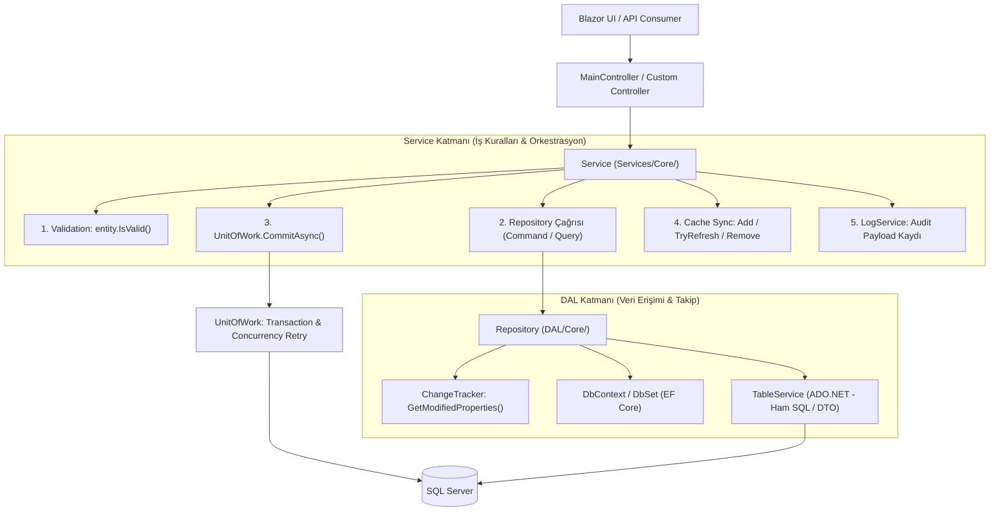
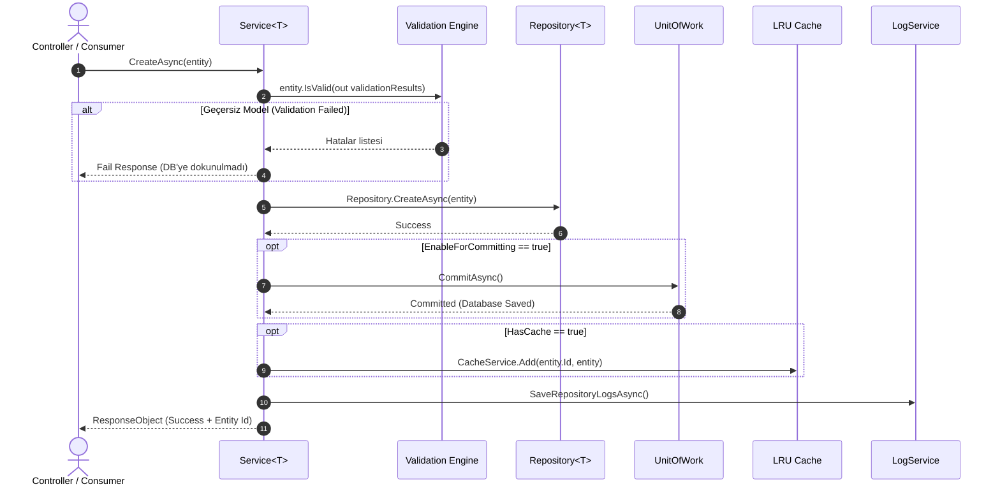
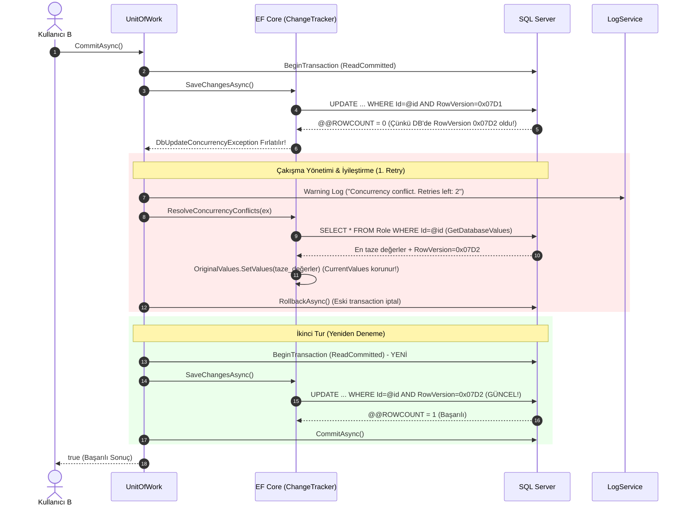

# 2.4 — Service ve Repository Mimarisi: Generic DAL, CQRS Ayrışması, Change Tracking, LRU Cache ve Unit of Work

Bu doküman, Hydra mimarisinin omurgasını oluşturan **Data Access Layer (Repository)** ve **Business Logic Layer (Service)** katmanlarını; aralarındaki sözleşmeleri, kısmi sınıf (partial class) organizasyonunu, derin denetlenebilirlik (change tracking / audit logging) mekanizmasını, işlem bütünlüğünü (Unit of Work), bellek içi önbellekleme (LRU Cache) stratejisini ve dairesel bağımlılıkları (circular dependency) çözen DI altyapısını ayrıntılı olarak belgeler.

---

## Büyük Resim: Uçtan Uca Veri ve Komut Akışı

Hydra'da bir HTTP isteği geldiğinde veya sistem içi bir iş mantığı çalıştığında katmanlar arasındaki sorumluluk dağılımı aşağıdaki gibidir:



---

## 1. Data Access Layer (DAL) ve `Repository<T>`

`Repository<T>`, veritabanı işlemlerini EF Core (`DbContext`) ve ham SQL altyapısı üzerinden yürüten generic veri erişim bileşenidir (`Hydra/DAL/Core/`). 

### A. CQRS Esintisi: Partial Class Ayrışması

Tek bir repository sınıfında yüzlerce satır kodun birbirine girmesini engellemek için `Repository<T>` C# `partial class` yeteneğiyle sorumluluklarına göre ikiye ayrılmıştır:

```
DAL/Core/
├── Repository.cs         --> Context yönetimi, ChangeTracker, Change Detection, UniqueFilter
├── Repository.Command.cs --> Veri yazma/değiştirme: Create, Update, Delete, DeleteRange, UpdateRange
└── Repository.Query.cs   --> Veri okuma: All, AnyAsync, CountAsync, FilterWithLinq, GetAsync, GetByIdAsync
```

1. **`Repository.cs` (Temel & Durum Takibi):**
   - `_context` ve `_dbSet` referanslarını tutar.
   - `GetAsEntityEntry(T entity)` ve `GetContextChangeTrackerEntries()` ile EF Core Change Tracker'a doğrudan erişir.
   - `UniqueFilter(T entity)`: Varsayılan olarak `t => t.Id == entity.Id` döndürür; doğal anahtara (natural key, örn. `Email` veya `Code`) sahip entity'ler bunu ezebilir (override).
   - `FromSqlInterpolated`: Parametreli ham SQL sorgularını güvenle çalıştırır.

2. **`Repository.Command.cs` (Komutlar):**
   - `CreateAsync(T entity)`: Kaydın `Id` değerini kontrol eder; boşsa `Guid.NewGuid()` (UUIDv7) atar. `AddedDate` ve `ModifiedDate` damgalarını vurur. `EntityState.Added` durumuna geçirir.
   - `CreateOrUpdateAsync(T entity, expression)`: Kaydın varlığını kontrol ederek otomatik olarak ekleme veya güncellemeye dallanır.
   - `DeleteAsync(T entity)`: Entity detached durumdaysa önce attach eder, ardından `EntityState.Deleted` durumuna çeker (soft delete veya hard delete).
   - `UpdateAsync(T entity)`: **Hydra'nın en kritik veri işleme metodudur** (aşağıda detaylandırılmıştır).

3. **`Repository.Query.cs` (Sorgular):**
   - `All(params string[] includes)`: `IQueryable<T>` döner, `Include` parametrelerini zincirler.
   - `GetAsync(filter, withAllIncludes, includes)`: Tekil kayıt çeker. `withAllIncludes: true` verilirse sanal `GetAllIncludes()` metodundaki tüm ilişkili tabloları otomatik bağlar.
   - `FilterWithLinqAsync(filter)`: Belleğe almadan önce filtre uygulayıp `List<T>` döner.

---

### B. Derin Değişiklik Tespiti (Change Tracking) ve Audit Payload

`Repository<T>.UpdateAsync`, standart bir `SaveChanges` çağrısından çok daha fazlasını yapar. Güncellenen entity'deki hangi alanların değiştiğini `ChangeTracker` üzerinden tespit eder:

```csharp
// DAL/Core/Repository.cs
private IEnumerable<string> GetModifiedProperties(T entity)
{
    var ee = GetAsEntityEntry(entity);
    var dbValues = ee.GetDatabaseValues(); // Veritabanındaki orijinal değerler
    if (dbValues == null) yield break;

    foreach (var propertyName in ee.CurrentValues.Properties.Select(p => p.Name))
    {
        // Audit meta-alanları karşılaştırmadan muaf tutulur
        if (new[] { nameof(IHasAuditFields.AddedDate), nameof(IHasAuditFields.ModifiedDate), nameof(IHasAuditFields.RowVersion) }.Contains(propertyName))
            continue;

        var original = dbValues[propertyName]?.ToString();
        var current = ee.CurrentValues[propertyName]?.ToString();

        // Byte dizileri için özel byte-by-byte equality kontrolü yapılır
        if (original != current)
            yield return propertyName;
    }
}
```

Eğer değişen alan varsa:
1. `entity.ModifiedDate = DateTime.Now` atanır.
2. Değişen alanların eski ve yeni değerleri (`EntityChangeSet { Property, OldValue, NewValue }`) JSON formatında `UpdateLogPayload` olarak serileştirilir.
3. Bu payload `Result.Logs` içine eklenerek otomatik audit trail (denetim izi) oluşturulur.
4. Hiçbir alan değişmemişse veritabanına boşuna update atılmaz; `"Nothing changed"` uyarısı dönülür.

---

### C. Dinamik Repository Çözümleme: `IRepositoryFactoryService`

Hydra'da yeni bir entity için özel repository (`EmployeeRepository`, `SystemUserRepository`) yazmak **zorunlu değildir**. 

```csharp
// DAL/Core/RepositoryFactoryService.cs
public IRepository<T>? CreateRepository<T>(DbContext context, params object[] additionalParameters) where T : BaseObject<T>
{
    var expectedInterfaceType = typeof(IRepository<T>);

    // [RegisterAsRepository] attribute'u ile işaretlenmiş özel bir sınıf var mı?
    var customRepoType = ReflectionHelper.GetTypeWithAttributeImplementingInterface<RegisterAsRepositoryAttribute>(
        _assembliesToScan,
        expectedInterfaceType
    );

    // Varsa onu, yoksa genel Repository<T>'yi kullan!
    var repositoryType = customRepoType ?? typeof(Repository<T>);

    var injector = new RepositoryInjector(context);
    return ReflectionHelper.CreateInstance(_serviceProvider, repositoryType, new object[] { injector }) as IRepository<T>;
}
```

- Özel iş kuralı gerektirmeyen entity'ler generic `Repository<T>` ile otomatik çalışır (Sıfır Boilerplate / DRY).
- Özel filtre veya optimizasyon gereken entity'ler ise `[RegisterAsRepository(typeof(IRepository<X>))]` ile işaretlenerek DI zincirine enjekte edilir.

---

## 2. İş Mantığı Katmanı ve `Service<T>`

`Service<T>`, istemcilerin (Web API controller'ları, background worker'lar) doğrudan muhatap olduğu iş mantığı orkestratörüdür (`Hydra/Services/Core/`).

### A. CQRS Ayrışması ve Sorumluluk Dağılımı

`Service<T>` de benzer şekilde kısmi sınıflarla yönetilir:

```
Services/Core/
├── Service.cs         --> Altyapı enjeksiyonları, UoW, Factory, Logging, Cache yönetimi, SeedAsync
├── Service.Command.cs --> Validation kontrolü, CUD operasyonları, Transaction Commit, Cache Invalidation
└── Service.Query.cs   --> Linq sorguları, Dynamic TableDTO/ITableService sorguları, Cache Lookup
```

---

### B. Bir Komutun Yaşam Döngüsü (`CreateAsync`, `UpdateAsync`)

`Service.Command.cs` içindeki bir mutasyon çağrısı 6 aşamalı sıkı bir güvenlik ve tutarlılık hattından geçer:



1. **Ön Doğrulama (Pre-Validation):** `entity.IsValid(...)` çağrılır. Veri tabanına SQL veya transaction açılmadan önce Hydra Validation kuralları kontrol edilir. Hata varsa doğrudan `IResponseObject` ile istemciye dönülür.
2. **Repository Çağrısı:** `Repository.CreateAsync` veya `Repository.UpdateAsync` çalıştırılır.
3. **İşlem Onayı (Commit):** Eğer `EnableForCommitting = true` ise `_unitOfWork.CommitAsync()` tetiklenir.
4. **Önbellek Eşitleme (Cache Sync):** Veritabanına başarıyla yazıldıysa bellek içi önbellek (`CacheService`) güncellenir:
   - `Create` $\rightarrow$ `CacheService.Add(id, entity)`
   - `Update` $\rightarrow$ `CacheService.TryRefresh(id, entity)`
   - `Delete` $\rightarrow$ `CacheService.Remove(id)`
5. **Denetim Günlüğü (Audit Flush):** Repository katmanında biriken `Result.Logs` kayıtları `ILogService` üzerinden asenkron olarak veritabanındaki `Log` tablosuna yazılır.
6. **Bütünleşik Yanıt:** İstemciye `IResponseObject` (`ResponseObject`, `ResponseObjectForUpdate` veya toplu işlemler için `ResponseObjectForBulkUpdate`) teslim edilir.

---

### C. Çift Yönlü Sorgu Yolu: EF Core LINQ vs Stateless `TableDTO`

Hydra'da veri okumak için iki farklı hat mevcuttur:

| Sorgu Yolu | Metot | Çalışma Şekli | Ne Zaman Kullanılır? |
|---|---|---|---|
| **ORM / LINQ Yolu** | `SelectWithLinqAsync` | EF Core `IQueryable<T>`, `AsNoTracking()`, `Include` | Derleme zamanında bilinen tip-güvenli sorgular, tekil kayıt getirme, backend içi filtreleme. |
| **Stateless Dinamik Yol** | `SelectWithTableAsync` | `TableDTO` $\rightarrow$ `Table` $\rightarrow$ `ITableService` $\rightarrow$ `QueryBuilder` $\rightarrow$ ADO.NET | Blazor Listeleme/Detay ekranları, dinamik kolon seçimi, UI üzerinden gelen runtime filtre ve sıralamalar. |

`SelectWithTableAsync`, EF Core'un runtime'da dinamik kolon üretmedeki hantallığını devre dışı bırakır. Doğrudan ADO.NET (`IDbCommand`) üzerinden sadece istenen kolonları çeker; hem SQL band genişliğini hem de sunucu CPU/RAM yükünü dramatik şekilde düşürür.

---

## 3. Veri Bütünlüğü: `UnitOfWork` ve Concurrency (Çakışma) Yönetimi

[`UnitOfWork`](file:///C:/Users/ararg/source/AIRepos/Hydra/DAL/Core/UnitOfWork.cs), veritabanı transaction yönetimini ve çakışma (*concurrency*) çözümlerini merkezileştirir. Hydra'da **Optimistic Concurrency (İyimser Eşzamanlılık)**, veri kaybını ve "üzerine yazma" (*lost update*) problemlerini engellemek için donanımdan SQL Server'a, EF Core Change Tracker'dan `UnitOfWork` sınıfına kadar otomatik iyileştirmeli (*self-healing / retry*) bir mekanizmayla kurgulanmıştır.

---

### A. Temel Altyapı: `[Timestamp]` ve `RowVersion` (SQL Server Seviyesi)

Tüm Hydra entity'lerinin türediği [`BaseObject<T>`](file:///C:/Users/ararg/source/AIRepos/Hydra/Core/BaseObject.cs) sınıfında şu tanım yer alır:

```csharp
// Hydra/Core/BaseObject.cs
[Timestamp]
[JsonIgnore]
public byte[]? RowVersion { get; set; } = null;
```

#### Bu Tanım Veritabanında ve Bellekte Ne Yapar?
1. **SQL Kolon Tipi (`varbinary(8)`):** SQL Server'da bu alan `ROWVERSION` (eski adıyla `TIMESTAMP`) tipinde 8 byte'lık bir binary kolon olarak oluşturulur.
2. **Otomatik Artan Sayaç:** SQL Server, veritabanı genelinde monotonik artan bir binary sayaç tutar. Bir tabloda ilgili satır `INSERT` edildiğinde ya da herhangi bir kolonu `UPDATE` edildiğinde, SQL Server **bu 8 byte'lık değeri otomatik olarak yeni ve daha büyük bir değere günceller**. Yazılımcının bu alana manuel değer ataması imkansızdır (SQL Server reddeder).
3. **Optimistic Concurrency Token:** EF Core, `[Timestamp]` attribute'unu gördüğü anda bu alanı bir "concurrency token" (çakışma jetonu) olarak işaretler.

---

### B. EF Core SQL Seviyesinde Çakışmayı Nasıl Algılar?

Bir entity'yi EF Core ile güncellediğinizde standart bir `UPDATE` sorgusu gönderilmez. EF Core sorgunun `WHERE` koşuluna **`RowVersion` eşitliğini** ekler:

```sql
UPDATE [Role] 
SET [Name] = @p0, [ModifiedDate] = @p1
WHERE [Id] = @p2 AND [RowVersion] = @p3; -- Concurrency jetonu!

SELECT [RowVersion] 
FROM [Role] 
WHERE @@ROWCOUNT = 1 AND [Id] = @p2;
```

#### Çakışma Senaryosu:
1. **Kullanıcı A** ve **Kullanıcı B** aynı anda aynı `Role` kaydını ekranlarına açtılar. İkisinin de elindeki nesnede `RowVersion = 0x00000000000007D1`.
2. **Kullanıcı A** açıklamayı `"İçerik Editörü"` yapıp "Kaydet"e bastı.
3. SQL Server satırı günceller (`WHERE [RowVersion] = 0x07D1` eşleşir). Satırın `RowVersion` değerini otomatik olarak `0x00000000000007D2` yapar. Etkilenen satır sayısı `@@ROWCOUNT = 1` olur. İşlem başarılıdır.
4. **Kullanıcı B** rolün adını `"Baş Editör"` yapıp "Kaydet"e bastı.
5. Kullanıcı B'nin EF Core'u hala ilk okuduğu `RowVersion`'ı (`0x07D1`) bildiği için şu SQL'i gönderir:
   ```sql
   UPDATE [Role] SET [Name] = 'Baş Editör' 
   WHERE [Id] = '...' AND [RowVersion] = 0x00000000000007D1;
   ```
6. Veritabanındaki satırın `RowVersion` değeri artık `0x07D2` olduğundan `WHERE` koşulu hiçbir satırla eşleşmez!
7. SQL Server'ın döndürdüğü etkilenen satır sayısı: **`@@ROWCOUNT = 0`**.
8. EF Core 1 satır güncelleme beklerken `0` satır güncellendiğini görünce durumu anlar: *"Bu kayıt ben okuduktan sonra başka biri tarafından değiştirilmiş!"* ve anında bir **`DbUpdateConcurrencyException`** fırlatır!

---

### C. `UnitOfWork.CommitAsync`: 3x Retry ve İyileştirme Döngüsü

Birçok framework bu hatayı doğrudan kullanıcıya fırlatıp *"Kayıt başka biri tarafından değiştirildi, sayfayı yenileyin"* diyerek işlemi çöpe atar. 

Hydra'nın [`UnitOfWork.CommitAsync`](file:///C:/Users/ararg/source/AIRepos/Hydra/DAL/Core/UnitOfWork.cs) metodu ise **otomatik iyileştirme (self-healing / retry)** algoritması çalıştırır:

```csharp
// DAL/Core/UnitOfWork.cs
public async Task<bool> CommitAsync()
{
    int retryCount = 3; // En fazla 3 deneme hakkı

    while (retryCount > 0)
    {
        // 1. Transaction ReadCommitted izolasyonuyla açılır
        await using var transaction = await Context.Database.BeginTransactionAsync(
            System.Data.IsolationLevel.ReadCommitted);

        try
        {
            await Context.SaveChangesAsync();
            await transaction.CommitAsync(); // Çakışma yoksa onaylanır
            return true;
        }
        catch (DbUpdateConcurrencyException ex)
        {
            retryCount--;

            // LogService üzerinden uyarı düşülür
            await _logService.SaveAsync(
                LogFactory.Warning(
                    category: nameof(UnitOfWork),
                    name: nameof(CommitAsync),
                    description: $"Concurrency conflict. Retries left: {retryCount}. Exception: {ex.Message}"),
                LogRecordType.Database);

            // Çakışmayı bellekte çöz! (Client Wins)
            ResolveConcurrencyConflicts(ex);

            // Başarısız transaction geri alınır
            await transaction.RollbackAsync();

            if (retryCount == 0) return false; // 3 denemede de çözülemediyse pes et
        }
        catch (Exception ex)
        {
            // Concurrency dışındaki SQL hataları (FK, Unique Key vs.)
            var friendlyMessage = SqlExceptionHelper.ToUserFriendlyMessage(ex);
            await _logService.SaveAsync(LogFactory.Error($"Commit failed: {friendlyMessage}"), LogRecordType.Database);
            await transaction.RollbackAsync();
            return false;
        }
    }
    return false;
}
```

---

### D. En Derin Nokta: `ResolveConcurrencyConflicts` Bellekte Ne Yapar?

`DbUpdateConcurrencyException` fırlatıldığında EF Core Change Tracker içinde 3 farklı veri kümesi bulunur:

```
+-----------------------------------------------------------------------------------+
|                              EF Core EntityEntry                                  |
+-----------------------------------------------------------------------------------+
| 1. OriginalValues : Entity belleğe ilk çekildiğinde var olan değerler (eski RowV) |
| 2. CurrentValues  : Bizim kullanıcımızın değiştirdiği alanlar (kaydetmek istenen) |
| 3. DatabaseValues : Şu an SQL Server diskinde duran en taze değerler (yeni RowV)  |
+-----------------------------------------------------------------------------------+
```

[`ResolveConcurrencyConflicts`](file:///C:/Users/ararg/source/AIRepos/Hydra/DAL/Core/UnitOfWork.cs#L88-L106) metodunun iç yüzü:

```csharp
// DAL/Core/UnitOfWork.cs
private void ResolveConcurrencyConflicts(DbUpdateConcurrencyException ex)
{
    foreach (var entry in ex.Entries)
    {
        // SQL Server'a gizli bir SELECT atıp satırın en taze halini çeker
        var databaseValues = entry.GetDatabaseValues();

        if (databaseValues == null)
        {
            // Satır güncellenmemiş, doğrudan veritabanından SİLİNMİŞ!
            entry.State = EntityState.Detached;
            continue;
        }

        // CLIENT WINS STRATEJİSİ:
        // OriginalValues'ı veritabanındaki yeni değerlerle (ve YENİ RowVersion ile) eşitler.
        // CurrentValues (kullanıcımızın yaptığı değişiklikler) ASLA BOZULMAZ!
        entry.OriginalValues.SetValues(databaseValues);
    }
}
```

#### Adım Adım İyileştirme Mekanizması:
1. `entry.GetDatabaseValues()` çağrıldığında EF Core SQL Server'a anında tekil bir `SELECT` atar:
   - Eğer sonuç `null` dönerse: Diğer kullanıcı bu satırı güncellememiş, **doğrudan silmiştir**. Artık güncellenecek bir şey kalmadığı için `entry.State = EntityState.Detached` yapılarak Change Tracker'dan düşürülür.
2. Eğer satır hala varsa:
   - `entry.OriginalValues.SetValues(databaseValues)` çalıştırılır.
   - Bu satır sihirli satırdır! EF Core'un hafızasındaki `OriginalValues["RowVersion"]` değeri artık `0x07D1` değil, Kullanıcı A'nın ürettiği en taze **`0x07D2`** olur!
   - Kullanıcı B'nin değiştirdiği alanlar (`CurrentValues`) ise **olduğu gibi korunur** (**Client Wins Stratejisi**).
3. Önceki transaction `await transaction.RollbackAsync()` ile temiz bir şekilde geri alınır.
4. `while (retryCount > 0)` döngüsü 2. tura başlar (`retryCount = 2`).
5. `await Context.Database.BeginTransactionAsync(...)` ile **yepyeni ve temiz bir SQL transaction'ı** açılır.
6. `await Context.SaveChangesAsync()` tekrar çağrılır.
7. EF Core bu sefer `WHERE [RowVersion] = 0x07D2` (güncel token) içeren `UPDATE` SQL'ini gönderir.
8. SQL Server satırı günceller, `@@ROWCOUNT = 1` döner ve `await transaction.CommitAsync()` çağrılarak işlem tamamlanır.
9. **Sonuç:** Kullanıcı B hiçbir hata ekranı görmez; çakışma arka planda milisaniyeler içinde sessizce çözülmüş ve işlemi başarıyla kaydedilmiştir.

---

### E. Concurrency Çözüm Akışı (Sequence Diagram)



---

### F. Diğer Hatalar: `SqlExceptionHelper` Nasıl Yakalar?

Eğer hata bir concurrency uyuşmazlığı değil de bir veritabanı kuralı (Constraint) ihlaliyse, [`SqlExceptionHelper`](file:///C:/Users/ararg/source/AIRepos/Hydra/Utils/SqlExceptionHelper.cs) devreye girer:

```csharp
// Utils/SqlExceptionHelper.cs
public static string ToUserFriendlyMessage(Exception ex)
{
    var baseException = ex.GetBaseException();
    var message = baseException.Message;

    // 1. Foreign Key hatası
    if (message.Contains("FOREIGN KEY constraint"))
        return ParseForeignKeyError(message); 
        // Çıktı: "Invalid reference. The related 'dbo.Employee.Id' record does not exist. (Constraint: FK_...)"

    // 2. Unique Key / Primary Key hatası
    if (message.Contains("UNIQUE KEY constraint") || message.Contains("PRIMARY KEY constraint"))
        return ParseUniqueConstraintError(message);
        // Çıktı: "A record with the value 'test@test.com' already exists in 'dbo.Employee'. (Constraint: UQ_...)"

    // 3. Deadlock durumu
    if (message.Contains("deadlock victim"))
        return "The system is currently busy. Please try again in a few moments. (Deadlock)";

    return ex.GetFullMessage();
}
```

Bu sayede:
- Çirkin SQL yığın izleri (*stack trace*) istemciye sızmaz.
- Kullanıcıya hangi tabloda, hangi alanın, hangi değer yüzünden çakıştığı son derece anlaşılır bir dille raporlanır.
- Transaction anında rollback edilerek SQL Server bağlantı havuzunun (connection pool) kilitlenmesi önlenir.

---

## 4. Yüksek Performans Önbellekleme: `LRUCacheService`

Sıkça sorgulanan ve nadiren değişen güvenlik çekirdeği entity'leri her HTTP isteğinde SQL'e gitmemelidir. 

Hydra, `IQueryableCacheService<Guid, T>` arayüzü üzerinden **En Az Son Kullanılanı Tahliye Eden (Least Recently Used - LRU)** bellek içi önbellek uygular (`capacity: 500`):

```csharp
// Hydra.WebApi/Extensions/ServiceCollectionExtensions.cs
services.AddSingleton<IQueryableCacheService<Guid, SystemUser>>(sp => new LRUCacheService<Guid, SystemUser>(capacity: 500));
services.AddSingleton<IQueryableCacheService<Guid, Role>>(sp => new LRUCacheService<Guid, Role>(capacity: 500));
services.AddSingleton<IQueryableCacheService<Guid, Permission>>(sp => new LRUCacheService<Guid, Permission>(capacity: 500));
services.AddSingleton<IQueryableCacheService<Guid, RoleSystemUser>>(sp => new LRUCacheService<Guid, RoleSystemUser>(capacity: 500));
services.AddSingleton<IQueryableCacheService<Guid, RolePermission>>(sp => new LRUCacheService<Guid, RolePermission>(capacity: 500));
```

- **Singleton Yaşam Döngüsü:** Önbellek tüm istekler (requests) arasında paylaşılır.
- **Şeffaf Entegrasyon:** `Service<T>` kurucusunda `SetCacheService(cache)` çağrıldığında, `Create`, `Update` ve `Delete` komutları belleği otomatik günceller.
- **Cache-First Arama:** `GetOrSelectThenCacheAsync` metodu önce LRU belleğe bakar; varsa SQL'e hiç dokunmadan $O(1)$ sürede döner.

---

## 5. Bağımlılık Enjeksiyonu ve Dairesel Bağımlılık Çözümü

### A. Constructor Bloat Çözümü: `ServiceInjector`

Geleneksel mimarilerde servislerin kurucusu zamanla 8-10 parametreye ulaşır (UnitOfWork, Mapper, Cache, Log, Config, DbContext...). Hydra bu karmaşayı [`ServiceInjector`](file:///C:/Users/ararg/source/AIRepos/Hydra/DI/ServiceInjector.cs) ile çözer:

```csharp
public class ServiceInjector : Injector
{
    public IUnitOfWork UnitOfWork { get; set; }
    public IRepositoryFactoryService RepositoryFactory { get; set; }
    public IConfiguration Configuration { get; set; }
    public IServiceProvider ServiceProvider { get; set; }
    public ITableService TableService { get; set; }
    public IServiceFactory ServiceFactory { get; set; }
    public ISessionContext SessionContext { get; set; }
}
```

Özel bir servis türetilirken sadece `ServiceInjector` almak yeterlidir:
```csharp
public class RoleService : Service<Role>
{
    public RoleService(ServiceInjector injector, IQueryableCacheService<Guid, Role> cache) 
        : base(injector)
    {
        SetCacheService(cache);
    }
}
```

---

### B. Dairesel Bağımlılık (Circular Dependency) Çözümü: `IServiceFactory` & `Lazy<T>`

`RoleService`, bir role ait kullanıcıları getirmek için `RoleSystemUserService`'e ihtiyaç duyar. Benzer şekilde `RoleSystemUserService` de rol detaylarını doğrulamak için `RoleService`'e ihtiyaç duyabilir. 

Standart constructor injection bu senaryoda uygulamanın açılışında kilitlenmesine (**Circular Dependency Exception**) sebep olur. Hydra bu problemi [`ServiceFactory.GetServiceLazy<T>()`](file:///C:/Users/ararg/source/AIRepos/Hydra/Services/Core/ServiceFactory.cs) deseniyle çözer:

```csharp
// Services/Core/ServiceFactory.cs
public Lazy<T> GetServiceLazy<T>() where T : class
{
    return (Lazy<T>)_lazyCache.GetOrAdd(
        typeof(T),
        _ => new Lazy<T>(() => _provider.GetRequiredService<T>())
    );
}
```

Kullanım:
```csharp
// Services/RoleService.cs
public async Task<List<SystemUser>> GetUsersAsync(Guid roleId)
{
    // Servis constructor'da DEĞİL, yalnızca bu metot çağrıldığında ilk kez resolve edilir!
    var roleSystemUserService = _injector.GetServiceLazy<RoleSystemUserService>().Value;
    return await roleSystemUserService.GetUsersAsync(roleId);
}
```

`_lazyCache`, thread-safe bir `ConcurrentDictionary` üzerinde `Lazy<T>` referanslarını saklar; hem gereksiz servis ayağa kaldırma maliyetini önler hem de dairesel kilitlenmeleri tamamen ortadan kaldırır.

---

## 6. Dosya Haritası

| Sorumluluk | Dosya / Dizin | Temel Tipler |
|---|---|---|
| Repository Arayüzü | `Hydra/DAL/Core/IRepository.cs` | `IRepository<T>` |
| Repository Çekirdeği | `Hydra/DAL/Core/Repository.cs` | `Repository<T>`, `UniqueFilter`, `GetModifiedProperties` |
| Repository Komutları | `Hydra/DAL/Core/Repository.Command.cs` | `CreateAsync`, `UpdateAsync`, `DeleteAsync`, `UpdateLogPayload` |
| Repository Sorguları | `Hydra/DAL/Core/Repository.Query.cs` | `All`, `FilterWithLinqAsync`, `GetAsync`, `GetByIdAsync` |
| Repository Factory | `Hydra/DAL/Core/RepositoryFactoryService.cs` | `IRepositoryFactoryService`, `RegisterAsRepositoryAttribute` |
| Repository DI Paketi | `Hydra/DI/RepositoryInjector.cs` | `RepositoryInjector` |
| Unit of Work | `Hydra/DAL/Core/UnitOfWork.cs` | `IUnitOfWork`, `UnitOfWork` |
| Service Arayüzü | `Hydra/Services/Core/IService.cs` | `IService<T>` |
| Service Çekirdeği | `Hydra/Services/Core/Service.cs` | `Service<T>`, `CommitAsync`, `LogService`, `CacheService` |
| Service Komutları | `Hydra/Services/Core/Service.Command.cs` | `CreateAsync`, `UpdateAsync`, `DeleteAsync`, `UpdateBulkAsync` |
| Service Sorguları | `Hydra/Services/Core/Service.Query.cs` | `SelectWithLinqAsync`, `SelectWithTableAsync`, `GetDetailsAsync` |
| Service Factory & Lazy | `Hydra/Services/Core/ServiceFactory.cs` | `IServiceFactory`, `ServiceFactory`, `GetServiceLazy<T>` |
| Service DI Paketi | `Hydra/DI/ServiceInjector.cs` | `ServiceInjector` |
| DI & Pipeline Kayıtları | `Hydra.WebApi/Extensions/ServiceCollectionExtensions.cs` | `AddHydraDependencies`, `AddDataAccessLayerDependencies` |

---

## ⭐ İleride Yapılacaklar (Future Improvements)

1. **Soft Delete Otomasyonu:** Şu an `Repository<T>.DeleteAsync`, `EntityState.Deleted` uyguluyor (hard delete). `BaseObject.IsActive` alanının varlığı göz önüne alınarak, `IDeletable` veya bir konfigürasyon bayrağı ile otomatik olarak `IsActive = false` (Soft Delete) yapılması repository seviyesinde desteklenebilir.
2. **Global Query Filter:** `IsActive == true` kontrolünün `DbContext.OnModelCreating` seviyesinde global query filter (`HasQueryFilter(e => e.IsActive)`) olarak eklenmesi sorgularda unutulma riskini sıfırlar.
3. **Outbox Pattern ile Audit Logging:** `UpdateAsync` içindeki `Result.Logs` kayıtları şu an doğrudan `LogService.SaveAsync` ile veritabanına yazılıyor. Yoğun trafikli sistemlerde bu logların bir kuyruğa (Queue / Background Channel) atılarak arka planda asenkron dökülmesi transaction sürelerini kısaltacaktır.
