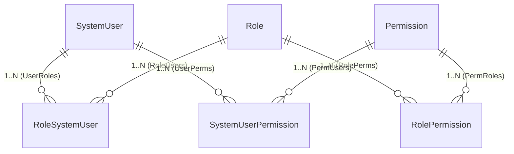

# 5.1 — Çekirdek Entity'ler ve Many-to-Many İlişki Yönetimi

Bu bölüm; `SystemUser` ve `Role` entity'lerini tek tek anatomik olarak inceler, aralarındaki **çoka-çok (Many-to-Many)** ilişkinin (`RoleSystemUser`) veritabanından kullanıcı arayüzüne kadar nasıl uçtan uca ve jenerik olarak yönetildiğini belgeler.

---

## 1. `SystemUser` (Sistem Kullanıcısı) Anatomisi

`SystemUser`, sisteme giriş yapabilen (kimlik doğrulama), yetkilendirilebilen ve sistemdeki her türlü denetim kaydına (Audit Logs) oturum bilgisi sağlayan temel kimlik nesnesidir.

```csharp
// Hydra/AccessManagement/SystemUser.cs
public class SystemUser : BaseObject<SystemUser>
{
    [Required]
    public string? Email { get; set; } = null;

    public bool EmailConfirmed { get; set; }

    public string? PasswordHash { get; set; } = null;

    public string? NickName { get; set; } = null;

    public Guid? PhoneNumberId { get; set; }
    public PhoneNumber? PhoneNumber { get; set; } = null;

    public bool PhoneNumberConfirmed { get; set; }

    [NotMapped]
    public bool IsAuthenticated { get; set; }

    public Guid? PasswordResetValidationToken { get; set; } = null;

    public ICollection<Role> Roles { get; set; } = new List<Role>();

    public List<RoleSystemUser> SystemUserRoles { get; set; } = new();

    public List<SystemUserPermission> SystemUserPermissions { get; set; } = new();

    public List<SessionInformation> SessionInformations { get; set; } = new();

    public override string UniqueProperty => Email ?? base.UniqueProperty;
}
```

### Kritik Mimari Detaylar:
1. **`UniqueProperty` Override'ı:** `BaseObject<T>`'in varsayılan tekillik alanı `Name`'dir. `SystemUser` bunu `Email` olarak ezer (`override`). Sebebi: Kurum içinde aynı isim-soyisme sahip personeller bulunabilir ancak kurumsal e-posta tekil olmak zorundadır.
2. **`BaseObject<T>` Kalıtımı:** Kullanıcının `Id`'si, `Name`'i (görünen ad/kullanıcı adı), `Description`'ı, `IsActive` (hesap dondurma) ve denetim alanları (`AddedDate`, `ModifiedDate`, `RowVersion`) otomatik olarak gelir.
3. **Çift İzin Kanalı:** Bir kullanıcının yetkileri hem üye olduğu roller üzerinden (`SystemUserRoles`) hem de kendisine özel tanımlanmış doğrudan istisna izinler üzerinden (`SystemUserPermissions`) beslenir.
4. **Çalışan (`Employee`) Bağı (0..1):** İnsan Kaynakları modülündeki `Employee.SystemUserId` alanı üzerinden gerçek bir personel kaydı bir `SystemUser` ile bağlanabilir. Ancak her `SystemUser` personel olmak zorunda değildir (örneğin salt servis veya harici entegrasyon kullanıcıları).

---

## 2. `Role` (Yetki Rolü) Anatomisi

`Role`, belirli bir görev tanımına (örn: `Admin`, `IT_Support`, `HR_Manager`, `Warehouse_Supervisor`) ait yetkileri ve sorumlulukları kümeleyen şablondur (Role-Based Access Control - RBAC).

```csharp
// Hydra/AccessManagement/Role.cs
public class Role : BaseObject<Role>
{
    public List<RoleSystemUser> RoleSystemUsers { get; set; } = new();

    public List<RolePermission> RolePermissions { get; set; } = new();

    public Role() { }
}
```

### Kritik Mimari Detaylar:
1. **Yalın ve Esnek:** `Role`, `BaseObject<Role>`'ten `Name` (rol adı), `Description` (rolün tanımı/açıklaması) ve `IsActive` alanlarını devralır.
2. **Rolün Yetkileri (`RolePermissions`):** Rol, `Permission` tablosuna `RolePermission` köprüsüyle bağlanır. Bir role verilen tüm izinler, o rolün tüm üyelerine otomatik olarak yansır.
3. **Rolün Üyeleri (`RoleSystemUsers`):** Role atanmış kullanıcılar köprü tablosu üzerinden tutulur.

---

## 3. Many-to-Many (`RoleSystemUser`) İlişkisi Neden Açık Köprü Entity ile Yönetilir?

EF Core, iki model arasında `ICollection<Role>` ve `ICollection<SystemUser>` tanımlandığında perde arkasında otomatik "gölge" (shadow) bir ara tablo üretebilir. Ancak Hydra, bunu bilinçli olarak **açık bir köprü entity** (`RoleSystemUser`) ile yapar:



```csharp
// Hydra/AccessManagement/RoleSystemUser.cs
public class RoleSystemUser : BaseObject<RoleSystemUser>
{
    [Required]
    public Guid RoleId { get; set; }

    [ForeignKey("RoleId")]
    public Role? Role { get; set; } = null;

    [Required]
    public Guid UserId { get; set; }

    [ForeignKey("UserId")]
    public SystemUser? SystemUser { get; set; } = null;

    public RoleSystemUser() { }
}
```

### Açık Köprü Kullanmanın 4 Temel Sebebi:

1. **İlişkinin Kendisinin Bir Varlık (`BaseObject`) Olması:**
   `RoleSystemUser` da bir `BaseObject`'tir. Kendi `Id`'si, `AddedDate`'i, `ModifiedDate`'i ve `IsActive` alanı vardır.
   - *"Bu kullanıcıya bu rolü kim, ne zaman atadı?"*
   - *"Rolü tamamen silmek yerine geçici olarak pasife (`IsActive = false`) alabilir miyiz?"*
   Soruları kurumsal sistemlerde zorunludur; gölge tablolarda bu denetim verileri kaybolur.
2. **Bedava Generic CRUD ve API Desteği:**
   `RoleSystemUser` bir `BaseObject` olduğu için, hiçbir ek endpoint kodlamadan doğrudan `MainController<RoleSystemUser>` ve `Service<RoleSystemUser>`'dan faydalanır:
   - Rol atamak = `POST api/RoleSystemUser/Create` `{ RoleId: "...", UserId: "..." }`
   - Rol geri almak = `DELETE api/RoleSystemUser/Delete/{id}`
   - Atamaları listelemek = `POST api/RoleSystemUser/Select`
3. **Frontend'de Çift Yönlü Master-Detail Yönetimi:**
   Blazor'ın generic `CollectionViewSection` bileşeni doğrudan bu köprü entity'yi dinleyebilir (bkz. Bölüm 5).
4. **Çoka-Çok İlişkide Çakışma Koruması:**
   Bir kullanıcıya aynı rolün mükerrer atanmasını engellemek için `(UserId, RoleId)` üzerinde composite unique index işletilir.

---

## 4. Servis Katmanı: Köprüyü Yönetme ve Önbellekleme

Rol-kullanıcı atamaları her yetki kontrolünde ve her login işleminde sorgulanır. Veritabanına gereksiz SQL yükü bindirmemek için `RoleSystemUserService` önbellek destekli çalışır:

```csharp
// Hydra/Services/RoleSystemUserService.cs
public class RoleSystemUserService : Service<RoleSystemUser>
{
    private readonly ServiceInjector _injector;

    public RoleSystemUserService(ServiceInjector injector,
                                 IQueryableCacheService<Guid, RoleSystemUser> cache) : base(injector)
    {
        _injector = injector;
        SetCacheService(cache);
    }

    // 1. Kullanıcının rollerini getir
    public async Task<List<Role>> GetRolesAsync(Guid userId)
    {
        var roleSystemUsers = await GetRoleSystemUsersAsync(ru => ru.UserId == userId);
        var roles = new List<Role>();

        foreach (var ru in roleSystemUsers)
        {
            var roleService = _injector.GetServiceLazy<RoleService>().Value;
            var role = await roleService.GetOrSelectThenCacheAsync(ru.RoleId);
            if (role != null) roles.Add(role);
        }

        return roles;
    }

    // 2. Roldeki kullanıcıları getir
    public async Task<List<SystemUser>> GetUsersAsync(Guid roleId)
    {
        var roleSystemUsers = await GetRoleSystemUsersAsync(ru => ru.RoleId == roleId);
        var users = new List<SystemUser>();

        foreach (var ru in roleSystemUsers)
        {
            var systemUserService = _injector.GetServiceLazy<SystemUserService>().Value;
            var user = await systemUserService.GetOrSelectThenCacheAsync(ru.UserId);
            if (user != null) users.Add(user);
        }

        return users;
    }
}
```

### Döngüsel Bağımlılığın (Circular Dependency) Çözümü: `GetServiceLazy<T>`
`SystemUserService` rolleri çekmek için `RoleSystemUserService`'e ihtiyaç duyar. `RoleSystemUserService` ise kullanıcıları yüklemek için `SystemUserService`'e ihtiyaç duyar.
Constructor enjeksiyonu kullanılırsa DI konteyneri döngüsel kilitlenmeye düşer. Hydra bu problemi **`ServiceInjector.GetServiceLazy<T>().Value`** modeliyle çözer: Servisler birbirine yalnızca ihtiyaç anında (runtime'da) tembel bağlanır.

---

## 5. Kullanıcı Arayüzünde (UI) Many-to-Many Yönetimi

Hydra mimarisinde rol ve kullanıcı eşleştirmesi, kullanıcı dostu **çift yönlü Master-Detail ekranları** ile yönetilir:

```
┌──────────────────────────────────────────────────────────┐
│ SystemUser Details (Kullanıcı Ekranı)                   │
│ - Ad: Ahmet Yılmaz                                       │
│ - Email: ahmet@hydra.com                                 │
│                                                          │
│ Sekmeler: [ Roller ]  [ Özel İzinler ]  [ Loglar ]       │
│ ┌──────────────────────────────────────────────────────┐ │
│ │ + Rol Ata (New Record)                               │ │
│ │ - Rol: Admin             Atanma: 2026-01-10  [Sil]   │ │
│ │ - Rol: IT_Support        Atanma: 2026-02-15  [Sil]   │ │
│ └──────────────────────────────────────────────────────┘ │
└──────────────────────────────────────────────────────────┘

                           ↕ (Aynı Köprü Tablo)

┌──────────────────────────────────────────────────────────┐
│ Role Details (Rol Ekranı)                                │
│ - Rol: Admin                                             │
│ - Açıklama: Tam Sistem Yöneticisi Rolü                   │
│                                                          │
│ Sekmeler: [ Üye Kullanıcılar ]  [ İzinler ]  [ Loglar ]  │
│ ┌──────────────────────────────────────────────────────┐ │
│ │ + Kullanıcı Ata (New Record)                         │ │
│ │ - Kullanıcı: Ahmet Yılmaz (ahmet@hydra.com)    [Sil] │ │
│ │ - Kullanıcı: Mehmet Demir (mehmet@hydra.com)   [Sil] │ │
│ └──────────────────────────────────────────────────────┘ │
└──────────────────────────────────────────────────────────┘
```

### Blazor Entegrasyonu:
1. **`SystemUser/Details.razor`:**
   ```razor
   <GenericDetailsView T="SystemUser" Client="Client" Id="@Id" Title="User Details">
       <CollectionViewSection Title="Assigned Roles" Controller="RoleSystemUser" ForeignKeyName="UserId" ParentId="@Id" />
   </GenericDetailsView>
   ```
2. **`Role/Details.razor`:**
   ```razor
   <GenericDetailsView T="Role" Client="Client" Id="@Id" Title="Role Details">
       <CollectionViewSection Title="Assigned Users" Controller="RoleSystemUser" ForeignKeyName="RoleId" ParentId="@Id" />
   </GenericDetailsView>
   ```

Yeni bir atama yapmak için açılan generic formda, `LookupService` otomatik olarak ilgili foreign key için dropdown seçeneklerini sunar (`RoleId` için tüm Roller, `UserId` için tüm Kullanıcılar).

---

## 6. Dosya Haritası

| Sorumluluk | Dosya Yolu |
|---|---|
| Kullanıcı Varlığı | `Hydra/AccessManagement/SystemUser.cs` |
| Rol Varlığı | `Hydra/AccessManagement/Role.cs` |
| Köprü Entity | `Hydra/AccessManagement/RoleSystemUser.cs` |
| Servisler | `Hydra/Services/SystemUserService.cs`, `RoleService.cs`, `RoleSystemUserService.cs` |
| API Controller'lar | `Hydra.WebApi/Controllers/SystemUserController.cs`, `RoleController.cs`, `RoleSystemUserController.cs` |
| ViewDTO'lar | `Hydra/DTOs/ModelDTOs/SystemUserDTO/SystemUserViewDTO.cs`, `Tentacle/.../DTOs/RoleDTO.cs` |
