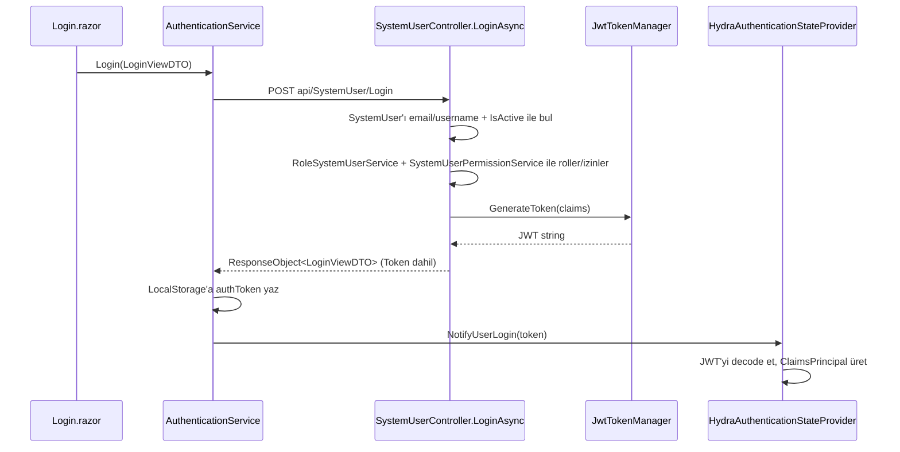

# 5.4 — Login'den Dashboard'a: `SystemUser`'ın İkinci Rolü

Önceki üç bölüm `SystemUser`/`Role`/`Permission`'ı birer CRUD entity'si olarak
ele aldı. Ama `SystemUser`'ın ikinci, daha kritik bir görevi var: **kimlik
doğrulama**. Bu bölüm o akışın Hydra tarafındaki mekaniğini anlatıyor — proje
özelinde "bizde şu an ne bağlı, ne değil" için `Tentacle/docs/login-to-dashboard-flow.md`'a
bakın, orası bu bölümün somut eylem planı.

## Akışın Hydra tarafındaki beş durağı

**1. `SystemUserController.LoginAsync`** — `[AllowAnonymous]`, tek endpoint.
Kullanıcıyı `su.Email == ... || su.Name == ...` ve `su.IsActive` ile bulur,
bulursa iki paralel zinciri tetikler: `service.GetRolesAsync(user.Id)`
(`RoleSystemUserService` üzerinden) ve `service.GetPermissionsAsync(user.Id)`
(`SystemUserPermissionService` üzerinden — [5.1](01-core-entities-and-relationships.md)'de
anlatılan köprü zinciri). Rolleri `ClaimTypes.Role` claim'i olarak (her rol için
bir claim, rol **Id**'si değeri ile — rol adı değil) token'a ekler.

**2. `JwtTokenManager`** — `Hydra/AccessManagement/Jwt/`. HS256 ile imzalar,
issuer/audience sabit (`hydra-api`/`hydra-clients`), süre varsayılan 1 saat.
Secret `ICustomConfigurationService.Get("JwtSecretKey", "fallback-secret")`
ile okunuyor — yani konfigürasyonda yoksa sessizce zayıf bir sabite düşüyor.

**3. `SessionInformationCacheManager`** — `SystemUserController`'ın
constructor'ında inject ediliyor, `LoginAsync`'in sonunda `_cacheManager.Login(SessionInformation)`
çağrılıyor (dikkat: kodda bu satır hem `try` bloğunun içinde hem dışında iki
kez çağrılıyor — küçük bir tekrar, işlevsel bir hata değil ama temizlenebilir).
`SessionInformation`, `ISessionContext`/`SessionContext` (`AsyncLocal` tabanlı)
üzerinden istek boyunca taşınıyor — bu, [1.4](../01-Architecture/04-tentacle-reference-app.md)'te
bahsedilen "her `BaseObject`'in otomatik Logs sekmesi" özelliğinin de
dayandığı mekanizma: bir kaydı kim, hangi oturumdan değiştirdi bilgisi buradan
geliyor.

**4. `AuthenticationService`** (RCL, istemci tarafı) — `Login` endpoint'ine
POST atar, dönen `Token`'ı `ILocalStorageService`'e yazar, sonra
`HydraAuthenticationStateProvider.NotifyUserLogin`'i çağırır.

**5. `HydraAuthenticationStateProvider`** — Blazor'un
`AuthenticationStateProvider` sözleşmesini karşılayan sınıf. JWT'nin payload
kısmını (base64url, padding düzeltmesiyle) çözüp `ClaimsPrincipal` üretiyor;
`ClaimTypes.Role` claim'i özel olarak işleniyor (dizi ise her elemanı ayrı
`Claim` yapıyor) çünkü JWT'de birden çok rol aynı claim adı altında dizi
olarak gelebiliyor.

Bu beş durak, kendi başlarına **tam ve doğru çalışıyor**. `AddHydraRazorLibrary()`
hepsini DI'a kaydediyor. Eksik olan, bunları birbirine **çağıran** kod — bir
sonraki bölüm bunu ayrıntılı anlatıyor.

## Neden bu beş durak yeterli değil: üç ayrı boşluk

`Tentacle/docs/login-to-dashboard-flow.md`'da ayrıntılı anlatılan üç boşluğun
özeti:

1. **`Login.razor`, `AuthenticationService.Login`'i hiç çağırmıyor** — "Log In"
   butonu doğrudan `/Dashboard`'a yönlendiren bir yer tutucu.
2. **WebApi'de JWT bearer şeması hiç kayıtlı değil** (`AddAuthentication().AddJwtBearer(...)`
   yok, `app.UseAuthentication()` yok) — token üretiliyor ama hiçbir yerde
   doğrulanmıyor; `[Authorize]` eklense bile çalışacak bir şema yok.
3. **`LoginAsync` şifreyi kontrol etmiyor** — `dto.Password` ile
   `user.PasswordHash` karşılaştırması kodda hiç yok. Bu üçü içinde en
   öncelikli olanı, çünkü bir güvenlik açığı, bir eksik özellik değil.

Bu üçü çözüldüğünde bile dördüncü bir adım gerekiyor: Blazor tarafında
route bazlı koruma (`<CascadingAuthenticationState>` + `<AuthorizeRouteView>`)
ve menüde role göre görünürlük (`<AuthorizeView Roles="...">`) — bugün
`Routes.razor` düz `<Router>`/`<RouteView>`, `NavMenu.razor` her linki
herkese gösteriyor.

## Dashboard: kilitlenmemiş ama sağlam

İronik bir nokta: `/Login` süs olsa da, `/Dashboard`'un **kendisi** iyi
kurulmuş. `Pages/Dashboard.razor`, `ApiClient<Request>`/`ApiClient<RequestCategory>`/`ApiClient<Employee>`
üzerinden toplam talep sayısı, durum/öncelik kırılımı, kategori dağılımı
(donut grafik, sunucudan gelen sayılarla hesaplanan `conic-gradient`) ve son
talepler tablosunu **gerçek veriyle** çiziyor — tasarımdaki mockup rakamlar
kullanılmamış. Kategori kırılımı bugün N+1 sorgu (her kategori için ayrı
sayım çağrısı) ile yapılıyor; kategori sayısı düşükken sorun değil, API'ye
tek seferde group-by dönen bir istatistik endpoint'i eklenirse tek çağrıya
iner (bkz. [1.4](../01-Architecture/04-tentacle-reference-app.md)).

Yani mevcut durumu bir cümlede özetlemek gerekirse: **arka oda (Dashboard)
temiz ve doğru döşenmiş, ön kapı (Login) süs, ve evin hiçbir odası kilitli
değil.** Kilitleri takmak için gereken anahtarların hepsi zaten cebimizde —
bkz. `Tentacle/docs/login-to-dashboard-flow.md`'daki adım adım plan.

## Dosya haritası

| Sorumluluk | Yol |
|---|---|
| Login endpoint | `Hydra.WebApi/Controllers/SystemUserController.cs` |
| JWT üretimi | `Hydra/AccessManagement/Jwt/JwtTokenManager.cs` |
| Oturum bağlamı | `Hydra/AccessManagement/SessionContext.cs`, `SessionInformation.cs` |
| İstemci auth servisleri | `Hydra.RazorClassLibrary/.../Services/Authentication/*.cs` |
| Login/Dashboard sayfaları | `Tentacle/Source/HydraTentacle.Blazor/Pages/{Login,Dashboard}.razor` |
| Proje-özel bağlama planı | `Tentacle/docs/login-to-dashboard-flow.md` |
