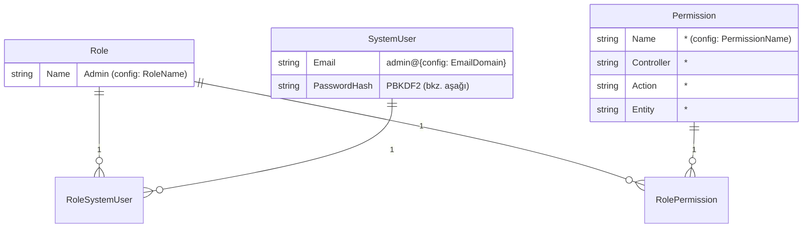

# 5.6 — Default Admin Seed: "Gaz Bulutundan" İlk Dashboard'a

Önceki dört bölüm `SystemUser`/`Role`/`Permission` üçlüsünü hem CRUD hem de
kimlik doğrulama açısından uçtan uca anlattı. Ama hepsinin ortak, sessiz bir
ön koşulu var: **veritabanında en az bir `SystemUser` satırı olması**. Boş bir
veritabanıyla ilk kez ayağa kalkan bir uygulamada (bugün Tentacle, yarın bir
veterinerlik/eczane/ERP uygulaması) login ekranına girecek hiç kimse yok —
"gaz bulutu" hâli budur. Bu bölüm, bu ilk-açılış boşluğunu **Hydra core
seviyesinde, jenerik ve config-driven** bir seed ile kapatan `DbInitializer.SeedDefaultAdmin`
adımını anlatıyor.

## Neden Hydra core'da, Tentacle'da değil

Bu, bilinçli bir mimari tercih: seed mantığı `Hydra/Services/DbInitializer.cs`
içinde yaşıyor — Tentacle'a özel bir yerde değil. Sebep basit: "ilk açılışta
gezinebilecek bir admin" ihtiyacı Tentacle'a özgü değil, **her** Hydra tabanlı
uygulamanın ortak sorunu. Bugün Tentacle, yarın başka bir uygulama
`Hydra.Services.DbInitializer.InitializeAsync<TDbContext>(...)`'i çağırdığı
an aynı seed'i, kendi `appsettings.json`'ındaki birkaç config anahtarıyla,
hiçbir ek kod yazmadan devralıyor.

**Bilinçli olarak dışarıda bırakılanlar:** `Position`, `Employee`,
`OrganizationUnit`. Bunlar ERP'ye özgü iş domaini kavramları — genel Access
Management'ın (bu bölümün konusu) parçası değil. Bir önceki taslakta bu ikisi
karışmıştı; bu seed sadece `SystemUser`/`Role`/`Permission` ve bunların iki
köprü tablosuna (`RoleSystemUser`, `RolePermission`) dokunuyor.

## Ne oluşturuyor



Beş satır tek `SaveChanges()` çağrısıyla yazılıyor: bir `Role`, bir
`SystemUser`, bir wildcard `Permission`, ve ikisini role bağlayan
`RoleSystemUser` + `RolePermission`.

## Config: `Hydra:DefaultAdmin`

Var olan `"Hydra"` bölümüne (`PlatformId`'nin zaten yaşadığı yere) yeni bir
alt bölüm eklendi — `ConnectionStrings`'e hiç dokunulmadı:

```json
// Tentacle/Source/HydraTentacle.WebApi/appsettings.json
"Hydra": {
  "PlatformId": "d3b2c1a0-5e6f-4789-9012-3456789abcde",
  "TableConnections": { "Log": "LogDbConnection" },
  "DefaultAdmin": {
    "Enabled": true,
    "EmailLocalPart": "admin",
    "EmailDomain": "tentacle.com",
    "Password": "ChangeMe123!",
    "RoleName": "Admin",
    "PermissionName": "*"
  }
}
```

Bir sonraki uygulama (örnek: bir eczane uygulaması) sadece `EmailDomain`'i
`"eczane-x.com"` yapıp kendi `Password`'ünü girerek aynı seed'i devralıyor —
`DbInitializer.cs`'de tek satır değişiklik gerekmiyor.

`SeedDefaultAdmin`, bu anahtarları `ICustomConfigurationService.Get(key, default)`
üzerinden okuyor — [5.4](04-login-to-dashboard-and-gaps.md)'te `JwtTokenManager`'ın
`JwtSecretKey`'i okuduğu yöntemin aynısı. Bunun anlamı: `Password` production'da
appsettings.json'a hiç yazılmadan, `ISecretManager`/ortam değişkeni/secret store
üzerinden override edilebiliyor (`CustomConfigurationService.Get`'in katman
sırası: Secret Manager → Config kökü → ConnectionStrings altı → default).

**Neden `EmailDomain` ve `Password`'ün varsayılanı yok, ama `EmailLocalPart`/`RoleName`/`PermissionName`'in var?**
Bilinçli bir asimetri: `Password` için paylaşılan kütüphane kodunun içine
gömülü bir varsayılan (`"ChangeMe123!"` gibi) — biri override etmeyi unutursa
production'a sızabilecek bir risk. Bu yüzden `EmailDomain` veya `Password`
config'te yoksa (`string.IsNullOrWhiteSpace`), seed **hiçbir şey yazmadan
sessizce atlıyor** ve bir `Warning` logluyor — `InitializePlatformTable`'ın
`Hydra:PlatformId` geçersizse yaptığı "atla, logla" davranışının aynısı.
`Hydra:DefaultAdmin:Enabled: false` ile de tamamen kapatılabiliyor (örneğin
prod'da otomatik admin oluşturulmasını hiç istemeyen bir kurulum için).

## Idempotency: neye göre "zaten seed edilmiş" deniyor

`InitializePlatformTable`, `Hydra:PlatformId`'deki sabit GUID'in DB'de olup
olmadığına bakıyordu. Bu seed'de öyle sabit bir kimlik yok — her uygulama
kendi `RoleName`'ini seçebiliyor. Bunun yerine doğal anahtar kontrolü
kullanılıyor:

```csharp
var alreadySeeded = context.Set<Role>().Any(r => r.Name == roleName);
if (alreadySeeded) return;
```

Yani "Admin" adında bir `Role` zaten varsa, seed hiç çalışmıyor — uygulama her
açılışta bu kontrolü yapıyor ama var olan veriye asla dokunmuyor (elle
değiştirilmiş bir Admin rolü/kullanıcısı üzerine yazmıyor).

## Neden raw ADO SQL değil, doğrudan EF Core `context`

`InitializePlatformTable` ve Log DB kurulumu bilerek raw `AdoNetDatabaseService`
SQL'i kullanıyor (tek tablo, sabit anahtar, düşük risk). Bu seed ise beş
tabloya, iki FK ilişkisine dokunuyor — bunu elle yazılmış çok-tabloluk
`INSERT` cümleleriyle yapmak kırılgan olurdu (FK sırası, tırnaklama, SQL
Server/Oracle lehçe farkları — `Hydra.csproj` her ikisine de paket referansı
taşıyor). `InitializeAsync` içinde zaten DI'dan çözülmüş `TDbContext context`
elde varken, `context.Set<Role>().Add(...)` + tek `SaveChanges()` çağrısı EF'in
change tracker'ına FK eşlemesini bırakıyor — hem daha az kod hem
provider-agnostic.

Tek incelik: normal CRUD akışında `AddedDate`/`ModifiedDate`'i
`Repository<T>.AddAsync` dolduruyor (`Hydra/DAL/Core/Repository.Command.cs`),
`HydraDbContext.SaveChangesAsync` bunu kendiliğinden yapmıyor. Bu seed
`Repository<T>` katmanını atlayıp doğrudan `context.SaveChanges()` çağırdığı
için, beş satırın da `AddedDate`/`ModifiedDate`'ini `Repository.Command.cs` ile
aynı şekilde (`DateTime.Now`) elle dolduruyor — aksi hâlde bu alanlar
`DateTime.MinValue` olarak kalırdı.

## Şifre: neden yeni bir `PasswordHasher` sınıfı

`Hydra.csproj`'de `Microsoft.AspNetCore.Identity`'ye referans yok — ve
eklenmedi, çünkü Hydra core aynı zamanda Blazor RCL tarafından da tüketiliyor;
tüm çekirdek kütüphaneye ASP.NET Identity gibi web'e özgü bir bağımlılık
sokmak orantısız olurdu. Bunun yerine `Hydra/Services/PasswordHasher.cs`
adında, .NET'in kendi `Rfc2898DeriveBytes.Pbkdf2`'sini kullanan, bağımlılıksız
minik bir yardımcı eklendi (PBKDF2-HMACSHA256, 100.000 iterasyon, saklama
formatı `"{iterasyon}.{saltBase64}.{hashBase64}"`).

```csharp
// Hydra/Services/PasswordHasher.cs
public static string Hash(string password) { /* ... */ }
public static bool Verify(string password, string? hashedValue) { /* ... */ }
```

Bu sınıfın seed dışında da bir amacı var: [5.4](04-login-to-dashboard-and-gaps.md)'te
dürüstçe belgelenen `SystemUserController.LoginAsync`'in şifre kontrolü hiç
yapmadığı boşluk düzeltildiğinde, `Verify()` orada da çağrılabilir —
`PasswordHasher.Hash`'in ürettiği format zaten `Verify`'ın beklediği format.
Yani bu seed, o ayrı ve önceliği daha yüksek olan güvenlik açığını
düzeltmiyor, ama düzeltilecek günü bekleyen hazır bir parça bırakıyor.

## Dürüst not: wildcard `Permission` bir veri iskeleti

[5.1](01-core-entities-and-relationships.md)'de belirtildiği gibi, bugün
**hiçbir çalışma zamanı kodu `Permission`/`RolePermission`/`SystemUserPermission`
kayıtlarını okuyup bir yetkilendirme kararı vermiyor** — `LoginAsync` sadece
rol **Id**'lerini JWT'ye claim olarak koyuyor. Yani bu seed'in yazdığı
`Controller="*", Action="*", Entity="*"` satırı bugün için **etkisiz bir veri
iskelesi**: ileride yazılacak bir yetkilendirme middleware'i/filtresi bu
satırı "her şeye izin ver" olarak yorumlayabilsin diye şimdiden orada duruyor,
ama bugün hiçbir isteği gerçekten etkilemiyor. Bunu böyle sunmak, "artık
yetkilendirme çalışıyor" gibi yanlış bir izlenim vermemek için bilinçli bir
tercih.

`Permission.Type` alanı için `ControllerActionBased` seçildi (Controller/Action
alanlarıyla tutarlı olduğu için) — ama yetkilendirme kodu yazıldığında bu
tek satırın mı yeterli olacağı, yoksa her `PermissionType` için ayrı bir
wildcard satırın mı gerekeceği henüz açık bir tasarım sorusu.

## Uygulamaya nasıl bağlanıyor

Tek bağlantı noktası zaten var olan çağrı:

```csharp
// Tentacle/Source/HydraTentacle.WebApi/Program.cs
Hydra.Services.DbInitializer.InitializeAsync<TentacleDbContext>(app.Services, app.Configuration);
```

`InitializeAsync` içinde `InitializePlatformTable`'dan hemen sonra
`SeedDefaultAdmin(context, services, logService)` çağrılıyor — Program.cs'de
hiçbir değişiklik gerekmedi.

## Dosya haritası

| Sorumluluk | Yol |
|---|---|
| Seed mantığı | `Hydra/Services/DbInitializer.cs` (`SeedDefaultAdmin`) |
| Şifre hash'leme | `Hydra/Services/PasswordHasher.cs` |
| Config okuma konvansiyonu | `Hydra/Services/CustomConfigurationService.cs` |
| Config anahtarları | `Tentacle/Source/HydraTentacle.WebApi/appsettings.json` → `Hydra:DefaultAdmin:*` |
| Seed edilen entity'ler | `Hydra/AccessManagement/{Role,SystemUser,RoleSystemUser,RolePermission}.cs`, `Hydra/AccessManagement/Permission.cs` |
| Normalde tarih damgalayan katman (bu seed'in atladığı) | `Hydra/DAL/Core/Repository.Command.cs` |

## ⭐ İleride Yapılacaklar

- Wildcard `Permission`'ın gerçek anlamı, bir yetkilendirme middleware'i
  yazıldığında netleşecek — bkz. yukarıdaki dürüst not.
- `PasswordHasher.Verify`, `SystemUserController.LoginAsync`'e henüz
  bağlanmadı — bkz. [5.4](04-login-to-dashboard-and-gaps.md) ve
  `Tentacle/docs/login-to-dashboard-flow.md`.
- Config'te `Password` düz metin olarak appsettings.json'da durabiliyor
  (dev varsayılanı); production'da `ISecretManager`/ortam değişkeni ile
  override edilmesi öneriliyor ama zorunlu kılınmıyor.
