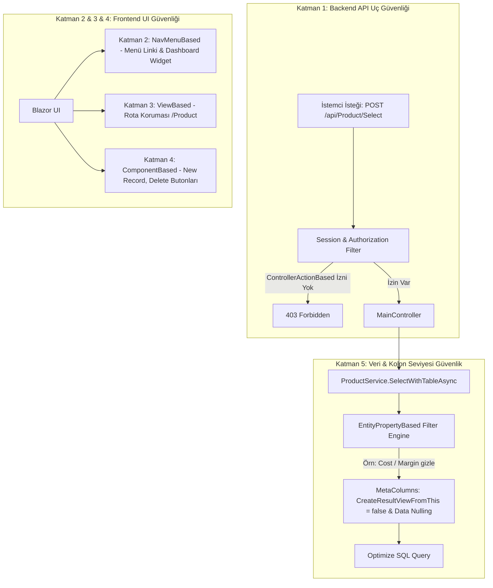

# 5.5 — İzin Matrisi ve Granüler Güvenlik: GedenLines'tan Hydra'ya 5 Katmanlı Yetkilendirme Mimarisi

Bu bölüm, Hydra'nın selefi olan **GedenLines** projesindeki yetkilendirme deneyimini, `PermissionType` enum'ının arkasındaki felsefeyi ve Hydra'nın `TableDTO`/`MetaColumnDTO` mimarisiyle bu yapının nasıl **uçtan uca, 5 katmanlı ve veri seviyesine kadar inen (fine-grained)** bir yetki motoruna dönüştürüleceğini belgeler.

---

## 1. GedenLines Kökleri: İzin Sistemi Nasıl Tasarlanmıştı?

GedenLines projesinde yetkilendirme, klasik bir "admin/user" rol ikilisinin çok ötesinde kurgulanmıştı. `Model.GedenLines.Permission` sınıfı incelendiğinde, sistemin 5 temel izin tipine ayrıldığı görülür:

```csharp
// GedenLines ve Hydra'da ortak enum:
public enum PermissionType
{
    ViewBased,              // Rota / Ekran bazlı
    ControllerActionBased,  // Backend API uç bazlı
    EntityPropertyBased,    // Kolon / Property bazlı
    NavMenuBased,           // Sol menü / navigasyon bazlı
    ComponentBased          // Buton / Form bileşeni bazlı
}
```

### GedenLines'ta Ne Vardı?
1. **Frontend Rota Koruması (`WhenAuthorized.razor`):** Sayfaların etrafı `<WhenAuthorized PermissionType="PermissionType.ViewBased">` ile sarılıyor; `BreadCrumb` servisinden son gezilen sayfa adı alınıp kullanıcının `ViewBased` izinleriyle kıyaslanıyordu.
2. **Navigasyon Koruması (`NavMenu.razor`):** Menü çocukları `AuthenticationService.IsAuthorized(PermissionType.NavMenuBased, ...)` çağrısıyla taranıyor ve `SetAllowed()` ile görünürlükleri açılıp kapatılıyordu.
3. **Bileşen / Buton Koruması (`TableComponent.razor`):** Grid aksiyon butonları (`ab.UniqueName`) `PermissionType.ComponentBased` ile kontrol edilerek yetkisiz butonlar devre dışı bırakılıyordu.
4. **Backend Yetkilendirme Taslağı (`CustomAuthorization.cs`):** `IAuthorizationFilter` uygulanmış, JWT `NameIdentifier` ile `SystemUserCache` üzerinden kullanıcının `Controller` ve `Action` izinlerinin taranması hedeflenmişti.

### GedenLines'ta Neler Tıkandı / Eksik Kaldı?
- **URL & Breadcrumb Kırılganlığı:** `ViewBased` kontrolleri URL split string'lerine (`visitedLastPage.SplitArray`) dayandığı için parametreli sayfalarda kırılganlaşıyordu.
- **Backend Entegrasyonu:** `CustomAuthorization` filtresi tam üretim seviyesine bağlanamamış, kodun önemli kısımları yoruma (`//`) alınmıştı.
- **EntityPropertyBased (Kolon Seviyesi) Boşluğu:** Kolon bazlı izin tipi enum'da tanımlanmış olmasına rağmen, SQL sorgusu ve dinamik DTO üretim aşamasına otomatik bağlanamamıştı.

---

## 2. GedenLines vs. Hydra: Karşılaştırma Matrisi

| Yetenek | GedenLines | Hydra (Mevcut Durum) | Hydra (Hedeflenen Tam Mimari) |
|---|---|---|---|
| **Veri Modeli** | `Permission`, `RolePermission`, `SystemUserPermission` | Birebir korundu (`BaseObject<T>` jenerikliğiyle zenginleşti) | Efektif izin havuzu + Redis/Memory cache |
| **`PermissionType` Enum** | 5 tip tanımlı | 5 tip tanımlı (`Hydra.IdentityAndAccess`) | 5 katmanlı karar motoru (Decision Engine) |
| **Backend API Koruması (`ControllerActionBased`)** | `CustomAuthorization` (tamamlanmamış) | Henüz filter/middleware bağlı değil | `HydraAuthorizeAttribute` & Action Middleware |
| **Menü Koruması (`NavMenuBased`)** | `NavMenuNew.razor`'da manuel kod | `NavMenu.razor` statik link basıyor | Meta-veri destekli dinamik menü filtreleme |
| **Sayfa / Rota Koruması (`ViewBased`)** | `BreadCrumb` string parse | `Routes.razor` düz router | Blazor `<AuthorizeRouteView>` + Route Guard |
| **Bileşen Koruması (`ComponentBased`)** | `<WhenAuthorized>` component | Statik butonlar | `GenericListView` ve `HydraGrid` aksiyon entegrasyonu |
| **Kolon / Alan Koruması (`EntityPropertyBased`)** | Fikir aşamasında kaldı | `TableDTO` ve `MetaColumnDTO` hazır ama izinle beslenmiyor | **DTO pipeline'ında yetkisiz kolonun SQL ve UI'dan otomatik sökülmesi** |

---

## 3. 5 Katmanlı İzin Spektrumu (The 5-Layer Permission Architecture)



### Katman 1: `ControllerActionBased` (Backend API Uç Güvenliği)
- **Amaç:** `Product/Select`, `Request/Create`, `SystemUser/Delete` gibi REST uçlarını doğrudan korumak.
- **Çalışma Mantığı:**
  - `MainController<T>` seviyesinde çalışan bir filtre veya middleware:
    ```csharp
    var currentController = ControllerContext.RouteData.Values["controller"]?.ToString();
    var currentAction = ControllerContext.RouteData.Values["action"]?.ToString();
    
    // Kullanıcının izinlerinde (Controller == currentController && (Action == currentAction || Action == "*")) var mı?
    ```
  - `*` veya `All` tanımıyla o controller'daki tüm eylemlere yetki verilebilir.
  - İzin yoksa istek controller'a hiç girmeden `403 Forbidden` ile sonlandırılır.

### Katman 2: `NavMenuBased` (Navigasyon ve Menü Görünürlüğü)
- **Amaç:** Yetkisi olmayan modülleri sol menüde (`NavMenu.razor`) veya Dashboard widget'larında kullanıcıya hiç göstermemek.
- **Çalışma Mantığı:**
  - Kullanıcı `SystemUser` modülünü görmeye yetkili değilse (`PermissionType.NavMenuBased`, Name: `"SystemUser"`), menüdeki `Users` linki DOM'a hiç basılmaz.
  - Dashboard üzerindeki talep, çalışan veya kullanıcı istatistik kartları da bu izin havuzunu dinleyerek koşullu çizilir.

### Katman 3: `ViewBased` (Blazor Sayfa / Rota Koruması)
- **Amaç:** Kullanıcı menüde link görmese bile tarayıcının adres çubuğuna doğrudan `http://localhost:5121/SystemUser` yazdığında sayfaya erişmesini engellemek.
- **Çalışma Mantığı:**
  - `App.razor` / `Routes.razor` içinde `AuthorizeRouteView` devreye girer.
  - Sayfa bileşeni (`Index.razor`, `Create.razor`, `Details.razor`) açılırken kullanıcının o view için izni (`ViewBased` + `"SystemUser/ListView"`) doğrulanır.
  - Yetkisiz ise `AccessDenied` sayfasına yönlendirilir.

### Katman 4: `ComponentBased` (Bileşen ve Aksiyon Butonları)
- **Amaç:** Kullanıcı bir listeyi görse bile üzerindeki kritik aksiyonları (Yeni Kayıt, Silme, Güncelleme, Excel Dışa Aktarma) kısıtlamak.
- **Çalışma Mantığı:**
  - `GenericListView<T>` içinde:
    - `ShowCreateButton`: Kullanıcının `ComponentBased` (`"Role/CreateButton"`) izni yoksa `false` olur.
    - `HydraGrid` satır aksiyonları: Satırdaki "Sil" (çöp kutusu) ikonu, kullanıcının `"Role/DeleteButton"` izni yoksa çizilmez.
  - `GenericDetailsView<T>` içinde:
    - Yetkisiz sekmeler (`CollectionViewSection`) gizlenir.

### Katman 5: `EntityPropertyBased` (Kolon ve Alan Bazlı Veri Güvenliği — En İnce Taneli / Fine-Grained)
- **Amaç:** Aynı ekrana bakan iki farklı roldeki kullanıcıdan birinin hassas alanları (örn: `SystemUser.PasswordHash`, `Employee.Salary`, `Request.Cost`, `Contract.SignOffDate`) görmesini engellemek.
- **Hydra'nın Benzersiz Avantajı:**
  Hydra, meta-veri güdümlü bir mimariye (`TableDTO` ve `MetaColumnDTO`) sahip olduğu için bu katmanı **zahmetsizce ve merkezi olarak** çözebilir:
  1. **Backend Pipeline'ında Filtreleme:**
     `Service<T>.SelectWithTableAsync` çalışırken, kullanıcının `EntityPropertyBased` izinleri kontrol edilir.
     Eğer kullanıcının `Entity == "Employee" && Property == "Salary"` izni yoksa:
     - `tableDTO.MetaColumns` içinden `Salary` kolonunun `CreateResultViewFromThis` bayrağı `false` yapılır veya kolon meta-veriden tamamen çıkarılır.
     - `RowDTO.Values` sözlüğünden `Salary` değeri silinir (`null` yapılır). Veri API yanıtına dahi yazılmaz.
  2. **Frontend'in Otomatik Tepkisi:**
     `HydraGrid`, `GenericDetailsView` ve `GenericFormView` ekranları doğrudan sunucudan gelen `TableDTO`'yu render ettiği için:
     - Grid'de o kolon **kendiliğinden kaybolur**.
     - Detay ekranında o property **kartta görünmez**.
     - Form ekranında o input **çizilmez**.
     - Frontend tarafında tek bir satır ekstra `if-else` yazılmasına gerek kalmaz!

---

## 4. Efektif İzin Havuzunun Hesaplanması

Bir kullanıcının nihai yetkileri iki kaynaktan beslenir:
1. **Roller Üzerinden Gelen İzinler:** `SystemUser` → `RoleSystemUser` → `Role` → `RolePermission` → `Permission`
2. **Kullanıcıya Doğrudan Verilen İzinler:** `SystemUser` → `SystemUserPermission` → `Permission`

```csharp
// Efektif İzin Birleştirme Algoritması
public async Task<HashSet<Permission>> GetEffectivePermissionsAsync(Guid userId)
{
    var directPermissions = await _systemUserPermissionService.GetPermissionsAsync(userId);
    var roles = await _roleSystemUserService.GetRolesAsync(userId);
    
    var rolePermissions = new List<Permission>();
    foreach(var role in roles)
    {
        rolePermissions.AddRange(await _rolePermissionService.GetPermissionsAsync(role.Id));
    }

    // Birleşim kümesi (Union) — Enabled == true olanlar
    var effective = directPermissions.Concat(rolePermissions)
                                     .Where(p => p.Enabled)
                                     .ToHashSet();

    return effective;
}
```

---

## 5. Uygulama Yol Haritası ve Mimari Standartlar

1. **Backend Uç Kontrolü:** `Hydra.WebApi` içerisine `PermissionAuthorizationFilter` eklenmeli, `MainController<T>` varsayılan olarak her endpoint'te `ControllerActionBased` iznini denetlemeli.
2. **DTO Güvenlik Kancası (Hook):** `Service<T>.SelectWithTableAsync` içine `ApplyPropertySecurity(tableDTO, sessionInfo)` kancası eklenmeli.
3. **Blazor RCL Koruması:** `Hydra.RazorClassLibrary` içindeki `GenericListView`, `GenericDetailsView` ve `NavMenu` bileşenleri `IAuthorizationService` üzerinden bu 5 izin tipini sorgulayacak şekilde standartlaştırılmalı.
