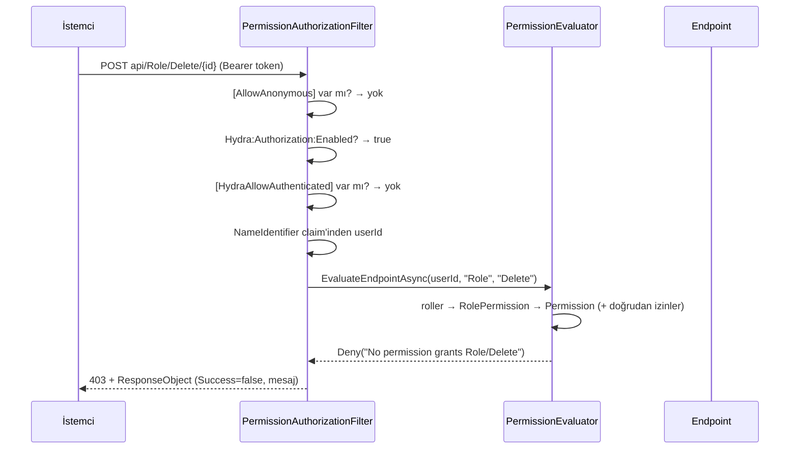

# 5.7 — Permission'ı Devreye Almak ve Kullanıcıya Ne Döndüğü

[5.6](05-default-admin-seed.md) dürüst bir itirafla bitiyordu: seed'in yazdığı
wildcard `Permission` satırı bir **veri iskelesiydi**, çünkü onu okuyup karar
veren hiçbir kod yoktu. Bu bölüm o boşluğu kapatıyor — ve kapatırken ortaya
çıkan asıl soruyu da cevaplıyor: *bir istek reddedildiğinde kullanıcı ne
görecek?*

## Bu bölüm 5 katmanın hangisi

[5.5](05-permission-matrix-and-granular-security.md) beş katmanlı bir
yetkilendirme mimarisi tarif ediyor. Bu bölüm o mimarinin **1. katmanını**
(`ControllerActionBased` — backend uç güvenliği) gerçekten çalışır hâle
getiriyor, ve zinciri uçtan uca bağlarken 2. ile 3. katmanların da ilk
hâlini kuruyor.

| Katman | Tip | Durum |
|---|---|---|
| 1 | `ControllerActionBased` | **Tam** — `PermissionAuthorizationFilter`, her uçta deny-by-default |
| 2 | `NavMenuBased` | **İlk hâli** — `hydra:endpoint` claim'i + `NavMenu`'de link gizleme |
| 3 | `ViewBased` | **İlk hâli** — `HydraRouteGuard`, her rota kapalı + `[HydraRequirePermission]` |
| 4 | `ComponentBased` | Henüz yok — butonlar koşulsuz çiziliyor |
| 5 | `EntityPropertyBased` | Henüz yok — `TableDTO`/`MetaColumnDTO` hazır ama izinle beslenmiyor |

5.5'teki `GetEffectivePermissionsAsync` taslağı (roller ∪ doğrudan izinler,
`Enabled` filtresi) neredeyse birebir uygulandı — `PermissionEvaluator`
içindeki aynı isimli metot. Wildcard için hem `"*"` hem `"All"` yazımı kabul
ediliyor, çünkü 5.5 ikisini birlikte tanımlıyor.

## Önce: kodu okuyunca ortaya çıkan beş kırık halka

Permission kontrolü yazmadan önce zincirin çalıştığını varsaymıştık. Kodu
satır satır okuyunca zincirin **hiç** çalışmadığı ortaya çıktı. Beş ayrı,
birbirinden bağımsız kırık:

| # | Ne | Sonucu |
|---|---|---|
| 1 | `ServiceCollectionExtensions.JwtDependencies` yazılmış ama `private` ve **hiçbir yerden çağrılmıyor** | Üretilen token'ı doğrulayacak bir bearer şeması hiç kayıtlı değildi |
| 2 | `SystemUserController._jwtTokenManager` alan olarak tanımlı ama constructor'da **hiç atanmıyor** | Kullanıcı bulunduğu anda `GenerateToken` `NullReferenceException` atıyor, `catch` yutuyor, ekranda "credentials do not match" görünüyordu |
| 3 | Üretilen token `dto.Token`'a **hiç yazılmıyor** | Token üretilse bile istemciye ulaşmıyordu (`AuthenticationService` `Token` alanını okuyor) |
| 4 | `AuthenticationService` `"api/SystemUser/Login"` adresini kullanıyor, `BaseAddress` zaten `.../api/` ile bitiyor | İstek `.../api/api/SystemUser/Login` adresine gidiyor — 404 |
| 5 | `HttpClientService`, 4xx gelince gövdeyi **hiç okumadan** `default` dönüyor | Sunucunun gönderdiği açıklama çöpe gidiyor, kullanıcı boş ekran görüyordu |

Buna [5.4](04-login-to-dashboard-and-gaps.md)'te belgelenen şifre
doğrulamasının hiç yapılmaması da eklenince tablo şu: **login uçtan uca hiç
çalışmamış**. Beşi de bu bölümde düzeltildi.

## Yetkilendirme modeli: kapalıdan başla

Tercih edilen politika **deny-by-default**: her uç varsayılan olarak kapalı.
Bir isteğin geçebilmesi için üç kapıdan birinin açık olması gerekiyor:



**Kapı 1 — `[AllowAnonymous]`.** Standart ASP.NET attribute'u. `Login` bunu
taşıyor; taşımasaydı sisteme hiç girilemezdi (içeri girmek için içeride olman
gerekirdi).

**Kapı 2 — `[HydraAllowAuthenticated]`.** Bu bölümde eklenen yeni, küçük bir
attribute: *kimlik gerekli ama özel bir izin gerekmiyor*. Buna ihtiyaç var
çünkü deny-by-default'ta `Logout` bile bir `Permission` satırı isterdi — ve
"çıkış yapma izni olmadığı için çıkış yapamayan kullanıcı" bir güvenlik
önlemi değil, bir hatadır. `[AllowAnonymous]`'tan kesinlikle daha zayıf:
kimlik yine şart, sadece izin araması atlanıyor.

**Kapı 3 — eşleşen bir `Permission`.** Asıl yol. `PermissionEvaluator`
kullanıcının **etkin izinlerini** topluyor: rollerinden gelenler
(`RoleSystemUser` → `RolePermission` → `Permission`) artı doğrudan verilenler
(`SystemUserPermission`) — yani [5.1](01-core-entities-and-relationships.md)'de
anlatılan üç köprünün hepsi nihayet kullanılıyor.

### Eşleşme kuralları (ve neden bu kadar dar)

1. İzin `Enabled` değilse hiç sayılmaz.
2. **Sadece `Type == ControllerActionBased` olan ya da `Name == "*"` olan
   izinler uç yetkilendirmesine katılır.** Bu kural kritik: bir
   `EntityPropertyBased` satırı (`Entity="Request"`, `Property="Price"`)
   `Controller`/`Action` alanlarını boş bırakır, ve 3. kurala göre boş "her
   şey" demektir — yani böyle bir satır, önlem alınmasa, sessizce **tüm
   sisteme** erişim verirdi. Alan bazlı izin tipleri view/menü kontrollerine
   ait, uç kararına sızmamalı.
3. Bir izin segmenti boş, null veya `"*"` ise "her şey"le eşleşir; değilse
   büyük/küçük harf duyarsız birebir eşitlik aranır. Yani
   `Controller="Role", Action=null` → RoleController'ın bütün action'ları.
4. `Name == "*"` küresel geçiş — Default Admin seed'inin yazdığı süper
   kullanıcı satırı. [5.6](05-default-admin-seed.md)'da "bugün etkisiz"
   dediğimiz satır, bu bölümle birlikte gerçekten çalışan şey hâline geldi.
5. `Permission.AllowAnonymous` bir kaçış valfi olarak onurlandırılıyor: uca
   eşleşen ve `AllowAnonymous=true` olan bir satır, o ucu herkese açar.
   Deny-by-default bir sistemin yaşayabilir olması için bu şart — halka açık
   bir uç, **bir satır veri**, bir kod değişikliği değil.

Karar verirken bir istisna atılırsa sonuç **red**tir. İzin deposu tökezlediği
için trafiği geçirmek, yetkilendirme sistemlerinin yetkilendirme sistemi
olmaktan çıkma biçimidir.

## Asıl soru: reddedilince kullanıcıya ne dönüyor

Buradaki tasarım kararı, `ResponseObject` sözleşmesini **bozmadan** eksik olan
yarıyı eklemek oldu.

### 401 mi 403 mü — ayrımı kimlik belirler, izin değil

| Durum | Kod | Anlamı | Kullanıcı ne yapabilir |
|---|---|---|---|
| Token yok / süresi dolmuş / geçersiz | **401** | Kim olduğunu bilmiyoruz | Yeniden giriş yapmak **çözer** |
| Token geçerli, ama eşleşen izin yok | **403** | Kim olduğunu biliyoruz, yine de olmaz | Yeniden giriş yapmak **çözmez** — yöneticiye gitmeli |

Bu ikisini karıştırmak, kullanıcıyı sonsuz bir "çıkış yap / tekrar gir"
döngüsüne sokar. `PermissionAuthorizationFilter` kodu izne göre değil, **kimliğin
çözülüp çözülmediğine** göre seçiyor.

### Hem gerçek HTTP kodu hem envelope

Reddedilen istek şunu döndürüyor:

```csharp
// PermissionAuthorizationFilter
var response = ResponseFactory.FromStatus(statusCode, detail: $"{controller}/{action}", actionName: action);

return new JsonResult(response) { StatusCode = statusCode };
```

Yani gövde **hâlâ standart `ResponseObject`** — `Success=false`, okunabilir bir
`Messages` listesi — ama HTTP durum kodu da gerçekten 403. Envelope'a eklenen
tek şey opsiyonel bir `StatusCode` alanı; mevcut alanların hiçbiri
değişmedi, eski kodun ürettiği yanıtlarda bu alan `null` kalıyor.

Neden ikisi birden:

- **Sadece HTTP 200 + `Success=false`** olsaydı, "yetkin yok" ile "kayıt
  bulunamadı" proxy, cache, tarayıcı network sekmesi ve log tarafında
  ayırt edilemezdi.
- **Sadece HTTP 403 + boş/düz metin gövde** olsaydı, `ResponseObject`
  sözleşmesi kırılırdı ve istemcinin gösterecek bir mesajı olmazdı.
- İkisi birlikte: kodu okuyan altyapı doğru şeyi görür, envelope'u okuyan
  istemci gösterilecek metni bulur.

### İstemci artık gövdeyi okuyor

`HttpClientService`'te en önemli değişiklik bu. Eskiden:

```csharp
if (!response.IsSuccessStatusCode)
{
    Console.WriteLine($"Client Error {response.StatusCode}: {url}");
    return default;   // ← gövde hiç okunmadı, mesaj kayboldu
}
```

Kullanıcı açısından sonucu şuydu: izin reddi ile "bu listede kayıt yok"
**birebir aynı** görünüyordu — boş ekran. Artık 4xx/5xx'te de gövde
`ResponseObject` olarak ayrıştırılıyor, mesajlar toplanıyor ve
`HydraStatusNotifier` üzerinden ekrana taşınıyor.

Ayrıca `PostAsync`'teki `EnsureSuccessStatusCode()` kaldırıldı: sunucu artık
reddi 401 ile bildirdiği için, exception fırlatmak kullanıcıya gösterilecek
tek anlamlı bilgiyi yok ediyordu.

## Kod yönetimi: tek katalog, tek sayfa

"300'ler 400'ler var ya, onları yönetebileceğimiz bir sayfa lazım" ihtiyacının
karşılığı üç parça:

**1. `HydraStatusCatalog` (Hydra core).** Kodun ne anlama geldiğini söyleyen
tek yer: başlık, kullanıcıya gösterilecek cümle, tür (`ClientError`/
`ServerError`/`Redirect`/`Success`), ikon adı ve "tekrar denemek anlamlı mı"
bilgisi. Bilinmeyen bir kod asla çıplak sayı olarak gösterilmiyor — aralığına
göre genel bir tanıma düşüyor. **Bütün uygulamaların bütün durum
mesajlarını çevirmek için değiştirilecek tek dosya burası.**

**2. `/status/{code}` sayfası (RCL).** Kataloğu okuyan tek generic sayfa.
Sayfanın kendisinde koda özel **hiç metin yok**. 401'de "Sign In", tekrar
denenebilir kodlarda "Try Again", her durumda "Go to Dashboard" düğmesi
gösteriyor.

**3. `<StatusMessageComponent />` (RCL).** Aynı kataloğu kullanan satır içi
uyarı şeridi. Layout'a bir kez konulduğunda, başarısız her API çağrısı
olduğu yerde görünür hâle geliyor. 401/403 varsayılan olarak bu şeritte
gösterilmiyor, çünkü onlar zaten tam sayfaya yönlendiriliyor — ikisi birden
çift gösterim olurdu.

## Konfigürasyon

```jsonc
"Secrets": {
  // HS256 en az 256 bit anahtar ister. Üretimde ortam değişkeni / secret store'dan gelmeli.
  "JwtSecretKey": "tentacle-development-signing-key-please-replace-in-production-0123456789"
},
"Hydra": {
  "Authorization": {
    "Enabled": true   // Kapatma anahtarı. Varsayılan AÇIK.
  }
}
```

İmza anahtarı, token'ı **üreten** taraf (`JwtTokenManager`) ve **doğrulayan**
taraf (bearer şeması) tarafından aynı yoldan çözülüyor — ikisinin farklı
anahtar kullanması, yalnızca çalışma zamanında "bütün token'lar geçersiz"
şeklinde ve hiçbir açıklama olmadan ortaya çıkan bir hata türü.

Anahtar tanımlı değilse artık **başlangıçta patlamıyor**, açıkça etiketlenmiş
bir geliştirme anahtarına düşüyor. (Eski kod `throw` ediyordu; dev makinesinde
secret yok diye uygulamanın açılmaması güvenlik değil, bozuk bir F5'tir.)

## Dürüst uyarılar

- **Zincir artık uçtan uca bağlı**: giriş yapılır, token LocalStorage'a yazılır,
  `HttpClientService` her isteğe ekler, sunucu doğrular. Sisteme girebilen tek
  hesap seed'in yazdığı admin (`Hydra:DefaultAdmin` ayarlarındaki e-posta ve
  şifre). Bir aksilikte acil çıkış yolu hâlâ duruyor:
  `"Hydra:Authorization:Enabled": false`.
- **Elle açılan kullanıcılar giremez.** Şifre doğrulaması artık gerçekten
  çalıştığı için, `PasswordHash`'i boş olan kayıtlar (UI'dan açılan tüm
  kullanıcılar) giriş yapamaz. Bugün girebilen tek hesap, seed'in
  `PasswordHasher.Hash` ile yazdığı admin. Kullanıcı oluşturma ekranının
  şifreyi hash'lemesi ayrı bir iş.
- **İzin claim'leri kolaylıktır, otorite değildir.** Token'a eklenen
  `hydra:permission` claim'leri arayüzün gereksiz düğme göstermemesi için;
  karar her istekte sunucuda yeniden veriliyor.
- **İzin değerlendirmesinde ayrı bir önbellek katmanı yok.** Alt servislerin
  LRU cache'leri var, ama her istekte rol→izin zinciri yeniden yürünüyor.
  Trafik arttığında kullanıcı bazlı kısa ömürlü bir cache gerekecek.

## İstemci tarafı: Blazor'da da kapalıdan başlamak

Sunucu kapatıldığında ortaya şu çıktı: dashboard'daki her liste "Unable to load data"
diyordu, ama **sayfaların kendisi hâlâ açıktı**. Yetkisiz bir kullanıcı Users, Roles,
Permissions ekranlarında gezinebiliyor, sadece içleri boş görünüyordu. Doğru davranış
sayfayı hiç göstermemek.

### Neden `AuthorizeRouteView` tek başına yetmiyor

Blazor'da "her sayfa giriş ister" diye bir anahtar yok. `<AuthorizeRouteView>` yalnızca
`[Authorize]` taşıyan sayfaları korur — yani attribute koymayı unuttuğun sayfa sessizce
herkese açık kalır. Bir yönetim uygulamasında bu yanlış varsayılan: **unutmak, ekranı
yayınlamamalı.**

`HydraRouteGuard` bunu tersine çeviriyor — sunucudaki `PermissionAuthorizationFilter`'ın
aynısı, sadece istemcide:

| Durum | Sonuç |
|---|---|
| Sayfada `[AllowAnonymous]` var ya da yol `AnonymousPaths` içinde | Sayfa çizilir |
| Giriş yapılmamış | `/Login?returnUrl=...` — geldiği yere geri dönebilsin diye |
| Giriş yapılmış ama `[HydraRequirePermission]` tutmuyor | `/status/403` — "permission denied" |
| Diğer | Sayfa çizilir |

İstisnalar **açıkça yazılıyor**: `Login`, `status`, `error` ve kök (`/`). Geri kalan her
rota kapalı.

### Fark edilen dördüncü kırık halka: rol claim'i hiç okunmuyordu

`HydraAuthenticationStateProvider`, token'daki rolleri `ClaimTypes.Role` **uzun URI'siyle**
arıyordu. Ama `JwtSecurityTokenHandler` token'a yazarken standart claim'leri kısaltır:
`ClaimTypes.Role` → `"role"`, `ClaimTypes.Name` → `"unique_name"`,
`ClaimTypes.NameIdentifier` → `"nameid"`. Yani aranan anahtar token'da hiçbir zaman yoktu:

```csharp
keyValuePairs.TryGetValue(ClaimTypes.Role, out object? roles);  // her zaman null
```

Sonucu: `<AuthorizeView Roles="Admin">` ve `[Authorize(Roles = "Admin")]` **sessizce hep
başarısız** oluyordu — hata vermeden, hiçbir şey göstermeden. Artık kısa adlar uzun
`ClaimTypes` karşılıklarına eşleniyor ve `ClaimsIdentity` `nameType`/`roleType` açıkça
verilerek kuruluyor (verilmezse `User.Identity.Name` ve `IsInRole` yine boş döner).

Aynı dosyada iki şey daha düzeldi: token'ın `exp` alanı artık kontrol ediliyor (süresi
dolmuş token'la "giriş yapmış görünüp her istekte 401 almak" mümkün olan en kafa karıştırıcı
durumdu) ve dizi hâlinde gelen claim'ler (roller, izinler) tek tek ayrıştırılıyor.

### Menüyü izne göre çizmek: `hydra:endpoint` claim'i

Token'a izin adları zaten konuyordu ama ad, "hangi ucu açıyor" sorusunu cevaplamıyor.
Bu yüzden login artık ikinci bir claim daha yazıyor: `hydra:endpoint` = `"Controller/Action"`
(boş segment `*`). Sadece `ControllerActionBased` izinler için — yani sunucunun uç kararında
dikkate aldığı tipin aynısı, ki **menü ile API aynı şeyi söylesin**.

`ClaimsPrincipalExtensions.CanAccessController("Role")` bunu okuyor; `NavMenu` erişilemeyen
modülün linkini DOM'a hiç basmıyor, grubun tamamı boşsa başlığı da göstermiyor. Eşleşme
kuralları `PermissionEvaluator` ile birebir aynı (`*`/`All`/boş = her şey).

Bu, [5.5](05-permission-matrix-and-granular-security.md)'in **2. katmanının**
(`NavMenuBased`) ilk hâli; `[HydraRequirePermission]` ile sayfa bazlı kontrol de
**3. katmanın** (`ViewBased`) ilk hâli.

### Prerender neden kapatıldı

Kimlik, LocalStorage'daki token'dan okunuyor; LocalStorage ise JS interop demek. Prerender
sırasında tarayıcı henüz yok — yani prerender açıkken her sayfa önce "anonim" çizilir,
ardından interaktif render'da düzelir. Kullanıcı bunu "bir an giriş ekranına atıldım, sonra
geri geldim" titremesi olarak görür. `App.razor`'da
`new InteractiveServerRenderMode(prerender: false)` bu sınıfın tamamını ortadan kaldırıyor.
Bir yönetim panelinde auth'ın ilk render'da doğru olması, prerender'ın faydasından değerli.

### Router'a RCL'yi tanıtmak

`/status/{code}` sayfası Hydra RCL içinde yaşıyor, `Router` ise varsayılan olarak **sadece**
uygulama assembly'sini tarar. `AdditionalAssemblies` verilmeseydi izin reddi yönlendirmesi
404'e düşerdi — koruma çalışır ama kullanıcı sebebini asla göremezdi.

### 401 ile 403 farklı yerlere gider

`HydraStatusNotifier` artık ikisini ayırıyor, çünkü kullanıcının yapabileceği şey farklı:
401 → giriş ekranı (tekrar giriş bunu **çözer**), 403 → "permission denied" sayfası (tekrar
giriş hiçbir şeyi değiştirmez).

### Dürüst not: bunların hiçbiri güvenlik değil

Menüyü gizlemek, rotayı kapatmak, butonu çizmemek — hepsi **gösterim** kararı. Token
kullanıcının kendi tarayıcısında; isteyen düzenler. Tek bağlayıcı karar, her istekte
sunucuda `PermissionEvaluator`'ın verdiği karar. İstemci tarafı sadece kullanıcıyı 403
duvarına yürütmeme nezaketi.

## Dosya haritası

| Sorumluluk | Yol |
|---|---|
| İzin değerlendirme | `Hydra/AccessManagement/Authorization/PermissionEvaluator.cs` |
| Kimlik gerektiren ama izin gerektirmeyen uçlar | `Hydra/AccessManagement/Authorization/HydraAllowAuthenticatedAttribute.cs` |
| Claim adları | `Hydra/AccessManagement/Authorization/HydraClaimTypes.cs` |
| Durum kodu kataloğu | `Hydra/Http/HydraStatusCatalog.cs` |
| Envelope'a eklenen `StatusCode` | `Hydra/Http/ResponseObject.cs`, `ResponseObjectExtensions.cs`, `ResponseFactory.cs` |
| Global yetkilendirme filtresi | `Hydra.WebApi/Filters/PermissionAuthorizationFilter.cs` |
| JWT şemasının etkinleştirilmesi | `Hydra.WebApi/Extensions/ServiceCollectionExtensions.cs` |
| Login zinciri | `Hydra.WebApi/Controllers/SystemUserController.cs`, `Hydra/AccessManagement/Jwt/JwtTokenManager.cs` |
| İstemci durum yönetimi | `Hydra.RazorClassLibrary/.../Services/Status/HydraStatusNotifier.cs`, `Services/Http/HttpClientService.cs` |
| Durum sayfası / şeridi | `Hydra.RazorClassLibrary/.../Pages/HydraStatusPage.razor`, `Components/StatusMessageComponent.razor` |
| İstemci rota koruması | `Hydra.RazorClassLibrary/.../Components/Security/HydraRouteGuard.razor`, `Security/HydraRequirePermissionAttribute.cs` |
| Claim okuma yardımcıları | `Hydra/AccessManagement/Authorization/ClaimsPrincipalExtensions.cs`, `HydraClaimTypes.cs` |
| Kimlik durumu / JWT ayrıştırma | `Hydra.RazorClassLibrary/.../Services/Authentication/HydraAuthenticationStateProvider.cs` |
| Giriş ekranı ve menü | `Tentacle/Source/HydraTentacle.Blazor/Pages/Login.razor`, `Layouts/NavMenu.razor`, `Routes.razor`, `App.razor` |
| Uygulama bağlantısı | `Tentacle/Source/HydraTentacle.WebApi/Program.cs`, `appsettings.json` |

## ⭐ İleride Yapılacaklar

- ~~`Login.razor` gerçek giriş yapsın, rota koruması, menüde görünürlük~~ →
  bu bölümde yapıldı (`HydraRouteGuard`, `hydra:endpoint` claim'i, `NavMenu`).
  Kalan: `ComponentBased` katmanı — `GenericListView`/`HydraGrid` üzerindeki
  Yeni/Sil/Düzenle butonlarının izne göre çizilmesi.
- Kullanıcı oluşturma/düzenleme ekranı şifreyi `PasswordHasher.Hash` ile
  yazsın; şifre sıfırlama akışı (`PasswordResetValidationToken` alanı zaten
  duruyor).
- Her controller/action için `Permission` satırlarını üreten bir tarayıcı
  (reflection ile uçları gezip eksik izinleri raporlayan/seed eden bir
  komut) — deny-by-default'ta bunu elle yönetmek uzun vadede sürdürülemez.
- İzin değerlendirmesi için kullanıcı bazlı kısa ömürlü cache.
- [5.5](05-permission-matrix-and-granular-security.md)'in kalan dört katmanı:
  `NavMenuBased` (menü), `ViewBased` (rota), `ComponentBased` (buton) ve
  özellikle `EntityPropertyBased` — `Service<T>.SelectWithTableAsync` içine
  `ApplyPropertySecurity(tableDTO, sessionInfo)` kancası eklendiğinde yetkisiz
  kolon hem SQL'den hem UI'dan kendiliğinden düşecek. Bu bölümde kurulan
  `PermissionEvaluator`, o dört katmanın da soracağı soruyu cevaplayacak
  ortak motor olarak tasarlandı.
