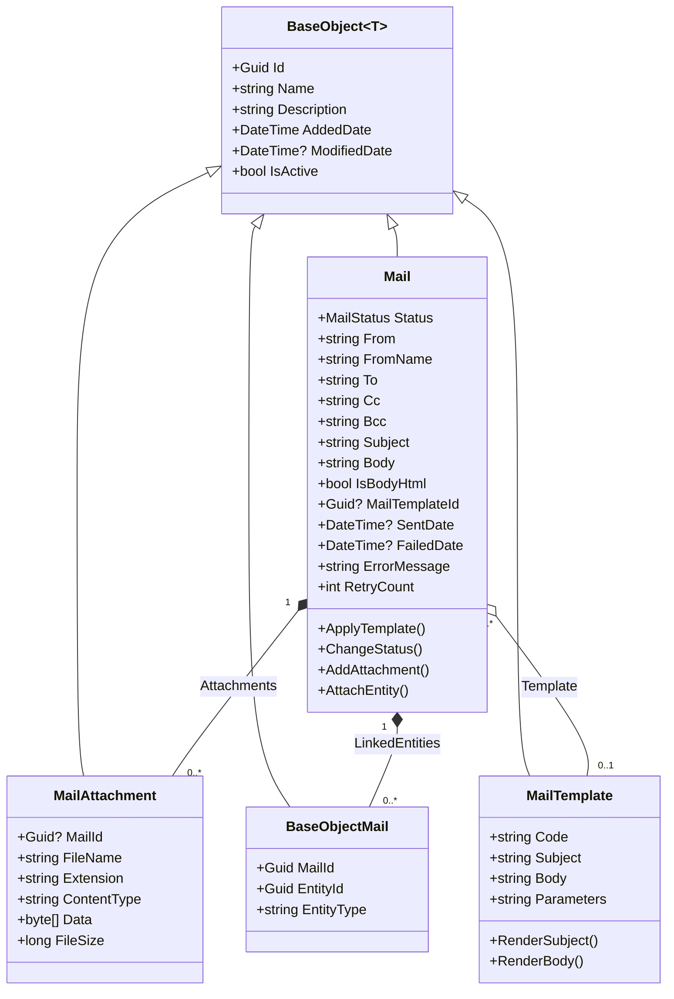
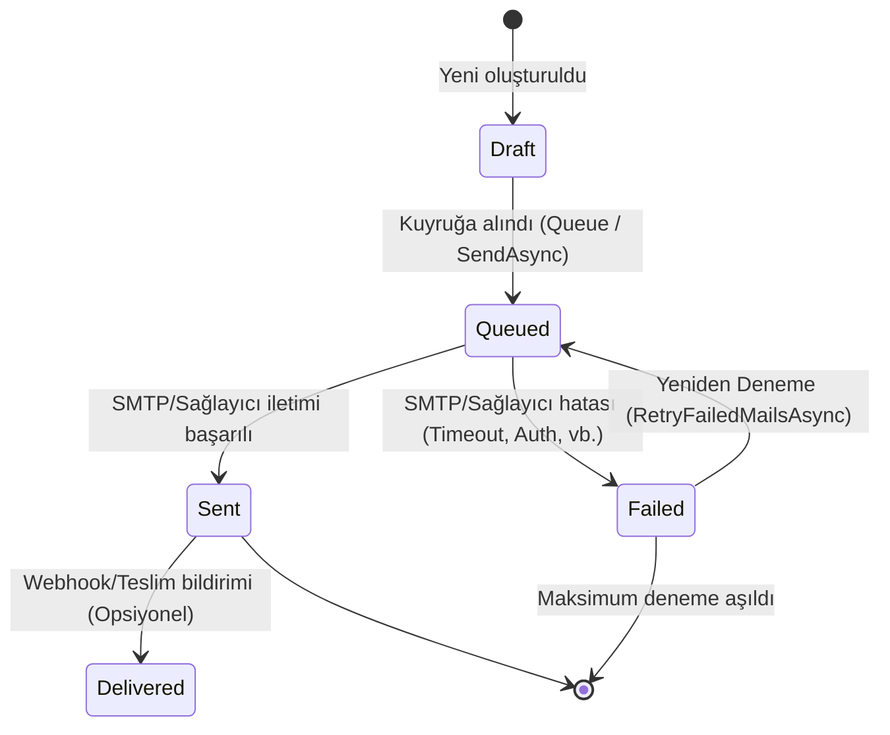

# Hydra.MailManagement — Architecture & Design

## Mimari Yaklaşım

`Hydra.MailManagement`, kurumsal e-posta yönetimini modern .NET 9 standartlarında, **SOLID**, **OOP**, **DRY** ve **Strategy / Adapter** tasarım desenlerine uygun olarak sunan tak-çıkar bir modüldür.

---

## Yaşam Döngüsü (State Machine)

Bir e-postanın veritabanındaki durum geçişleri:

---

## Tasarım Desenleri (Design Patterns)

1. **Adapter Pattern (`IMailEngineService` -> `FluentEmailEngineService`):**
   * Hydra'nın domain varlığı olan `Mail` nesnesini üçüncü taraf iletim sağlayıcısı olan `IFluentEmail` API'sine dönüştürür.
   * İleride `MailKit`, `SendGrid` veya `Amazon SES` API'sine geçilmek istendiğinde yalnızca yeni bir `IMailEngineService` implementasyonu yazmak yeterlidir (Open/Closed Principle).

2. **Application Part Pattern (`Hydra.MailManagement.WebApi`):**
   * ASP.NET Core `ApplicationPart` mekanizması kullanılarak controller sınıfları tüketici API'nin routing tablosuna çalışma zamanında eklenir.

3. **Polymorphic Link Pattern (`BaseObjectMail`):**
   * E-postaları tek bir nesne tipine hapsetmez (`OrderMail`, `UserMail`, `InvoiceMail` gibi tablolar türetilmez).
   * `EntityType` ve `EntityId` ikilisi ile Hydra ekosistemindeki **herhangi bir entity** ile ilişki kurulabilir.
